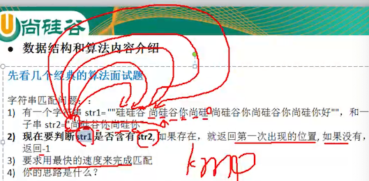
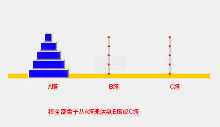
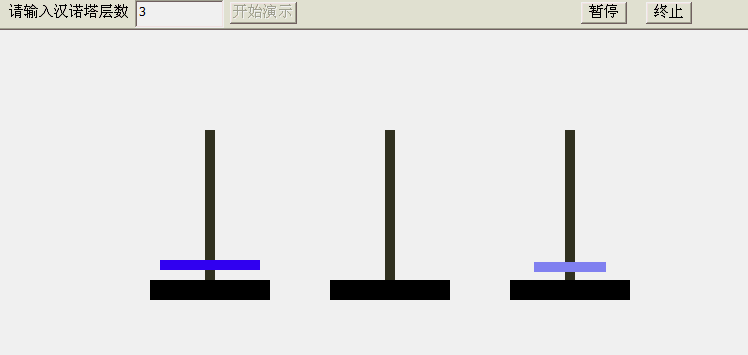
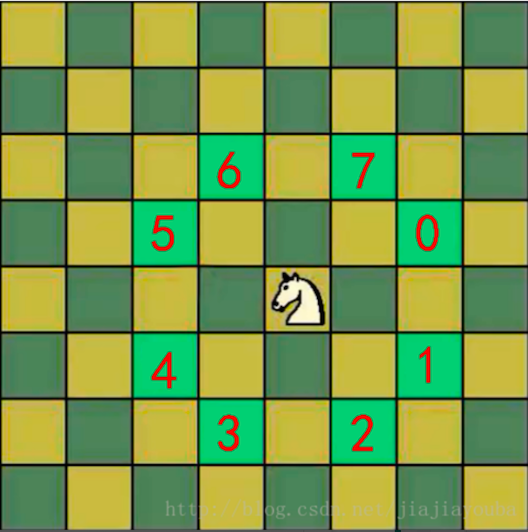

# 内容介绍

先来看几个经典的算法面试题，了解下算法大概是个什么东西

## 字符串匹配问题

有如下字符串 ，判定 str1 中是否包含 str2，如果出现则返回第一次出现的位置，如果没有则返回 -1

```bash
str1 = "硅硅谷 尚硅谷你尚硅 尚硅谷你尚硅谷你尚硅你好"
str2 = "尚硅谷你尚硅你"
```

要求用最快的速度来完成匹配，你的思路是什么？

### 暴力匹配

没有学过算法的一般会想到：**暴力匹配**



如上图：

1. 先拿第一个「尚」去挨个匹配
2. 匹配成功，则拿第 2 个字去匹配
3. 如果不匹配，则从头开始

暴力匹配法优缺点：

- 优点：简单，容易理解

- 缺点：效率低下

  可以看到上图的描述，只要有一个不匹配，就从头开始再来，「回溯」次数太多。

### KMP 算法

这里不深入讲解。会建立一个「部分匹配表」，然后通过表里的搜索词，大大提高效率

## 汉诺塔游戏



汉诺塔游戏目标：将 A 塔的所有圆盘移动到 C 塔

汉诺塔游戏规则：

- A 塔有 5 个圆盘，（最多的时候可有 64 个）
- 小圆盘上不能放大圆盘
- 三根柱子之间一次只能移动一个圆盘

看一个简单的 3 个盘子的移动演示



知道咋玩了吧？

- 三个的时候还是比较简单，只要了 5 步就移动完成了
- 4 个盘子的时候，就需要 15 步了
- 5 个盘子的时候，需要 31 步了
- 如果是 20 个盘子呢？

如果用算法来解决，就要用到 **分治法**

## 八皇后问题

八皇后问题，是一个古老而著名的问题，是 **回溯算法** 的典型案例。

该问题是国际西洋棋棋手马克斯·贝瑟尔于 1848 年提出：在 8×8 格的国际象棋上摆放八个皇后，使其不能互相攻击，即：任意两个皇后都不能处于同一行、同一列或同一斜线上，问有多少种摆法。


使用回溯算法，高斯认为有 **76 种方案**。1854年在柏林的象棋杂志上不同的作者发表了40种不同的解，后来有人用图论的方法解出 **92 种结果**。计算机发明后，有多种计算机语言可以解决此问题

可以去百度搜索下这个小游戏，自己玩几下感受下，还是很难的

## 马踏棋盘算法



**马踏棋盘算法** 也被称为骑士周游问题，将马随机放在国际象棋的 8×8 棋盘 `Board[0～7][0～7]`的某个方格中，马按走棋规则（马走日字）进行移动。要求每个方格只进入一次，走遍棋盘上全部 64 个方格，如果没有日字可走，那么游戏结束

可玩下这个 [小游戏](http://www.4399.com/flash/146267_2.htm)

会使用到 **图的深度优化遍历算法（DFS）** + **贪心算法优化**，如果只是图算法，效率很低下，可能需要 30 秒才能走一步

可见算法在不同场景下发挥着不同的作用，**算法的基础又是数据结构**

这里展示的 4 个算法面试题是为了告诉你：

- 算法的重要性
- 算法很有趣
- 有一定的难度

但是：不会算法的程序员，会被逐渐淘汰。

## 数据结构和算法的重要性

- 算法是程序的灵魂

  优秀的程序可以在 **海量数据计算时**，依然 **保持高速计算**。

  数据结构是基础，学算法前基础必学

- 一些计算框架、缓存技术的核心功能其实也是算法

  比如内存计算框架 Spark、缓存技术 Redis 等。

  算法和现实中的工种一样，也分领域的。不一定要学习所有领域的算法，常用的一定要学习了解。

- 实际工作中也有类似的感受：程序是有灵魂的，就是算法

  老师在 Unix 下开发了一个程序，要求支持上千万人同时在线，当时写完，内测后一切 OK，上线之后就不行了，服务器撑不住了。
  
  公司 CTO 阅读了代码之后，发现没有做缓存，针对这些优化了之后，再次上线就可以了。
  
  通过这个经历就感受到了：程序是有灵魂的。
  
- 大厂面试会有数据结构和算法的面试题

  目前程序员面试的门槛越来越高，大厂在这方面有一定的要求。

- 如果你不想永远都是代码工人，那么就话时间研究下数据结构和算法

## 课程内容介绍

课程内容很多，学完后或许会回来补上，或许会专门有一个导航入口。  

## 课程亮点和授课方式

- 课程深入，非蜻蜓点水

- 课程成体系，非星星点灯

- 高效而愉快的学习

  数据结构和算法很有用，很好玩

- 数据结构和算法很重要，但是相对困难，努力做到通俗易懂

- 采用 

  ```
  应用场景 ->  数据结构或算法 -> 剖析原理 -> 分析实现步骤（图解） -> 代码实现 的步骤讲解
  ```

- 课程目标

  让大家掌握本质，达到能在工作中 **灵活运用解决实际问题** 和 **优化程序 **的目的

