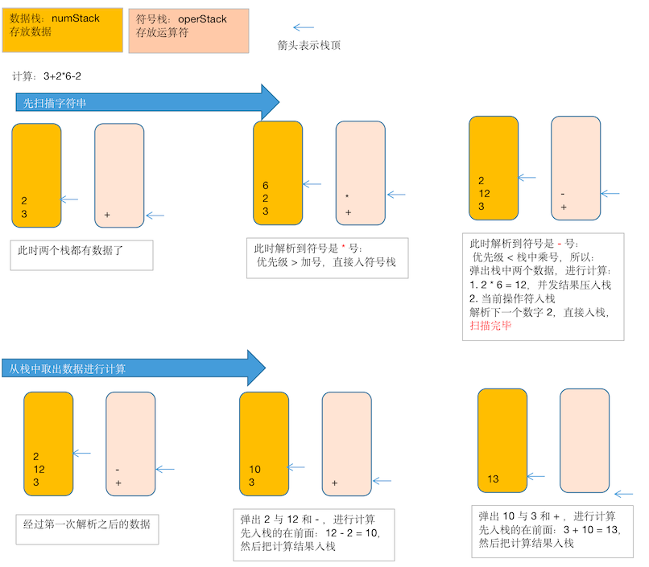

# 综合计算器-中缀表达式

使用栈来实现综合计算器，比如，输入一个表达式：`7*2*2-5+1-5+3-3` ，计算出这个表达式的结果

## 思路分析

如上图：

1. 需要先扫描字符串，可以通过一个 index 变量来辅助扫描

2. 如果 **发现是一个数字**，**直接入数栈**

3. 如果 **发现是一个操作符**，分以下情况：

   1. 当 **当前操作符** 的优先级 **大于** 栈顶符号**：将 **当前操作符** 入符号栈
   2. 当 **当前操作符** 的优先级 **小于 栈顶符号栈**：
      1. 弹出数栈中的 2 个数值
      2. 弹出符号栈顶的符号
      3. 2 个数字和这个符号进行计算
      4. 将计算结果压入数栈
      5. 将当前操作符压入符号栈

4. 当扫描完毕时：

   1. 顺序的从数栈中弹出 2 个数，
   2. 从符号栈中弹出 1 个操作符
   3. 将他们进行计算，然后把计算结果压入数栈中

   然后重复上面的三个步骤

5. 最后在数栈中只会存在一个数值，它就是结果。

上图经过一个简化的计算表达式，描述了每个重要步骤栈中数据的分布。可以跟着推敲下。