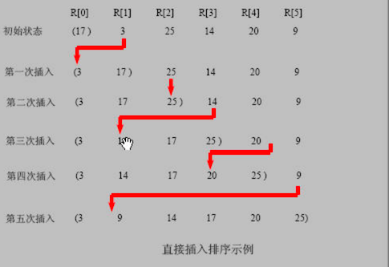

# 插入排序 

## 基本介绍

插入排序属于内部排序法，是对于欲排序的元素以 **插入的方式寻找该元素的适当位置**，以达到排序的目的。

该 插入排序又被称为直接插入排序或简单插入排序。

## 基本思想

插入排序（Insertion Sorting）的基本思想是：

1. 把 n 个待排序的元素 **看成** 为一个 **有序表** 和 **无序表**

2. 开始时，有序表中只包含一个元素，无序表中包含有 n - 1 个 元素

排序过程中每次 **从无序表中取出第一个元素**，把它的排序码 **依次与有序表元素的排序码进行比较**，将它插入到有序表中的适当位置，使之成为新的有序表。

## 思路分析



如上图，初始有 5 个元素序列。

- 第一个元素作为初始的有序表，剩下的其他作为无序表
- 当第一次比较时：无序表中的第一个元素取出来与有序表倒数第一个元素比较（从小到大），发现 3 小于 17，于是插入到有序表中适当的位置

以此类推，直到比较完成。

## 代码实现

为了简单分析，使用这样一个场景：有一群小牛，考试成绩分别是 101、34、119、1，从小到大排序

```java
 /**
     * 为了更好的理解，将插入排序演变过程演示出来，逐步推导的方式演示
     */
    @Test
    public void processDemo() {
        int arr[] = {101, 34, 119, 1};
        System.out.println("原始数组：" + Arrays.toString(arr));
        processSelectSort(arr);
    }

    private void processSelectSort(int[] arr) {
        // 第 1 轮：
        // 有序表：101
        // 无序表：34, 119, 1
        // 值的注意的是：不一定就要分两个数组来操作，这样想，就想太复杂了。只是看成两段
        int currentInsertValue = arr[1]; // 当前要找位置插入的数
        int insertIndex = 1 - 1; // 要插入的数与有序表中最后一个开始比较（存储的是下标）。也就是当前数的上一个开始比较

        while (insertIndex >= 0  // 保证插入数组不越界
                // 当前与有序列表中的数据进行对比
                // 如果小于：则说明有序表中的该值需要向后移动
                // 例如：101, 34, 119, 1 , 34 < 101, 移动后变成 101, 101, 119, 1
                //      currentInsertValue = 34，insertIndex = -1
                && currentInsertValue < arr[insertIndex]
        ) {
            arr[insertIndex + 1] = arr[insertIndex];  // 向后移动一位
            insertIndex--; // 并将下一次要比较的有序列表往前一位
        }
        // 当退出循环后：要么 insertIndex = -1, 说明应该插入到有序列表中的第一个位置
        //            要么 就找到了合适的位置，所以无论哪一种情况， insertIndex + 1，才是当前数要插入的位置
        arr[insertIndex + 1] = currentInsertValue;
        System.out.println("第 1 轮排序后：" + Arrays.toString(arr));

        // 第 2 轮：
        // 有序表：34, 101
        // 无序表：119, 1
        currentInsertValue = arr[2]; // 当前要找位置插入的数：119
        insertIndex = 2 - 1; // 当前的上一个开始

        while (insertIndex >= 0  // 保证插入数组不越界
                // 当前与有序列表中的数据进行对比
                // 如果小于：则说明有序表中的该值需要向后移动
                // 例如：34, 101, 119, 1 , 119 > 101, 这里不满足，则退出
                //      currentInsertValue = 119，insertIndex = 1
                && currentInsertValue < arr[insertIndex]
        ) {
            arr[insertIndex + 1] = arr[insertIndex];  // 向后移动一位
            insertIndex--; // 并将下一次要比较的有序列表往前一位
        }
        // 当退出循环后：这一轮，则是当前数大于有序表中的最后一个，不用换位置
        // 那么  1 + 1 = 2，下标和当前的数是相同的，就算这里替换了，数组还是保持不变的
        // 这里可以判断下是否相同，不相同再赋值，也是可以的
        arr[insertIndex + 1] = currentInsertValue;
        System.out.println("第 2 轮排序后：" + Arrays.toString(arr));

        // 第 3 轮：
        // 有序表：34, 101, 119
        // 无序表：1
        currentInsertValue = arr[3]; // 当前要找位置插入的数：1
        insertIndex = 3 - 1; // 当前的上一个开始

        while (insertIndex >= 0  // 保证插入数组不越界
                // 当前与有序列表中的数据进行对比
                // 如果小于：则说明有序表中的该值需要向后移动
                // 例如：34, 101, 119, 1 , 1 < 119, 移动后：34, 101, 119, 119
                //      currentInsertValue = 1，insertIndex = 2
                // 然后继续下一个比较： 34, 101, 119, 119， 1 < 101 , 移动后：34, 101, 101, 119
                //      currentInsertValue = 1，insertIndex = 1
                // 然后继续下一个比较： 34, 101, 101, 119， 1 < 34 ,  移动后：34, 34, 101, 119
                //      currentInsertValue = 1，insertIndex = -1
                && currentInsertValue < arr[insertIndex]
        ) {
            arr[insertIndex + 1] = arr[insertIndex];  // 向后移动一位
            insertIndex--; // 并将下一次要比较的有序列表往前一位
        }
        // 当退出循环后：这一轮，则是 insertIndex = -1，退出循环，把当前的数插入到有序表的开头
        arr[insertIndex + 1] = currentInsertValue;
        System.out.println("第 3 轮排序后：" + Arrays.toString(arr));
    }
```

测试输出

```
原始数组：[101, 34, 119, 1]
第 1 轮排序后：[34, 101, 119, 1]
第 2 轮排序后：[34, 101, 119, 1]
第 3 轮排序后：[1, 34, 101, 119]
```

从上述推导过程，我们发现了规律：

- 循环体和赋值都是一样的
- 不同的是当前待插入的数，和要比较的有序表下标

那么可以改写成如下方式：

```java
    @Test
    public void processDemo2() {
        int arr[] = {101, 34, 119, 1};
        System.out.println("原始数组：" + Arrays.toString(arr));
        processSelectSort2(arr);
    }

    private void processSelectSort2(int[] arr) {
        for (int i = 1; i < arr.length; i++) {
            // 只是将这两句代码的代表当前要插入的下标用外循环的变量来代替了
            int currentInsertValue = arr[i];
            int insertIndex = i - 1;

            while (insertIndex >= 0
                    && currentInsertValue < arr[insertIndex]
            ) {
                arr[insertIndex + 1] = arr[insertIndex];
                insertIndex--;
            }
            arr[insertIndex + 1] = currentInsertValue;
            System.out.println("第 " + i + " 轮排序后：" + Arrays.toString(arr));
        }
    }
```

### 大量数据耗时测试

排序随机生成的 8 万个数据

```java
    /**
     * 大量数据排序时间测试
     */
    @Test
    public void bulkDataSort() {
        int max = 80_000;
        int[] arr = new int[max];
        for (int i = 0; i < max; i++) {
            arr[i] = (int) (Math.random() * 80_000);
        }

        Instant startTime = Instant.now();
        selectSort(arr);
//        System.out.println(Arrays.toString(arr));
        Instant endTime = Instant.now();
        System.out.println("共耗时：" + Duration.between(startTime, endTime).toMillis() + " 毫秒");
    }
```

多次测试输出

```
共耗时：825 毫秒
共耗时：976 毫秒
共耗时：818 毫秒
```

平均耗时在 900 毫秒左右