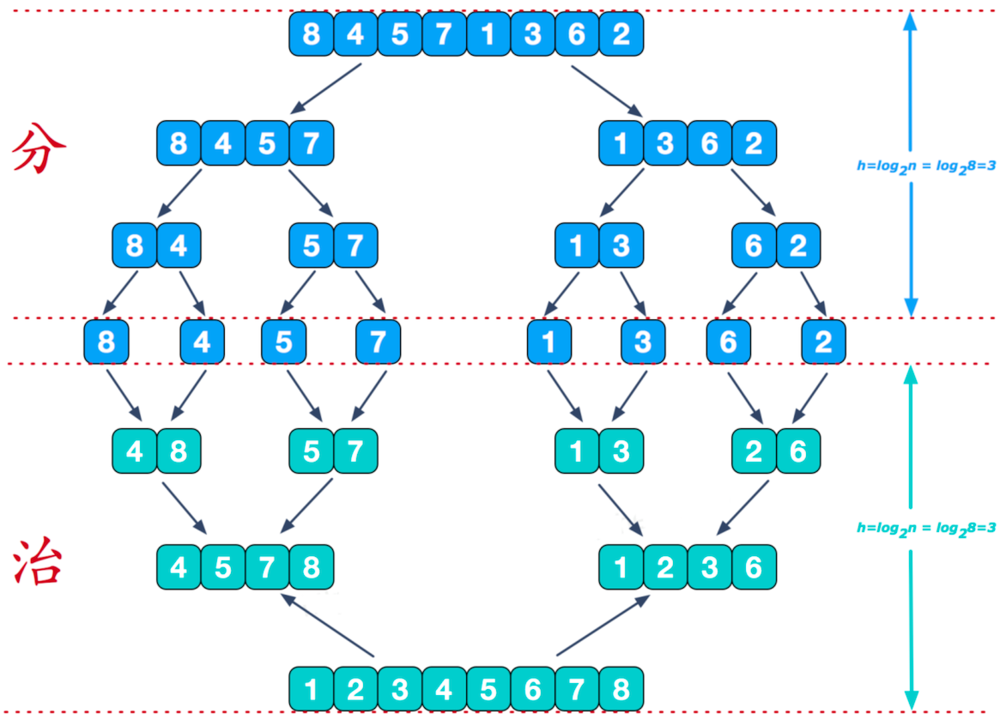
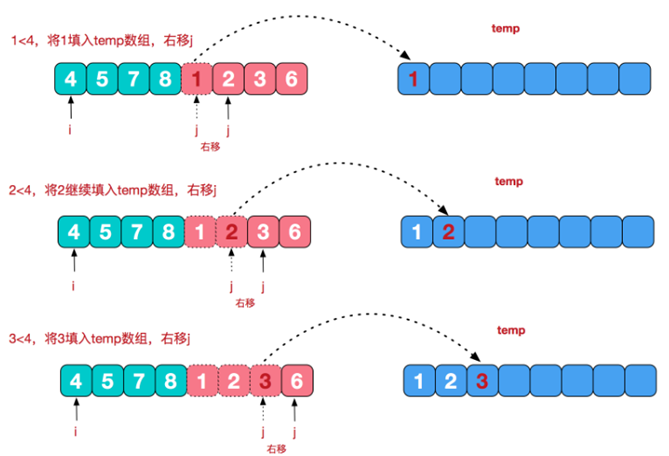

# 归并排序

## 简单介绍

归并排序（merge sort）是利用 **归并** 的思想实现的排序方法，该算法采用经典的 **分治**（divide-and-conquer）**策略** ：

- 分（divide）：将问题分成一些小的问题，然后递归求解
- 治（conquer）：将分的阶段得到的各答案「修补」在一起

即：分而治之

## 基本思想

- 分：的过程只是为了分解
- 治：分组完成后，开始对每组进行排序，然后合并成一个有序序列，直到最后将所有分组合并成一个有序序列

可以看到这种结构很像一颗 **完全二叉树**，本文的归并排序我们采 **用递归实现**（也可采用迭代的方式实现）。**分阶段** 可以理解为就是递归拆分子序列的过程。

## 思路分析

对于分阶段相对较简单，下面着重来对治阶段进行分析。

合并相邻有序子序列分析：下图以 **归并排序的最后一次合并** 为例来分析，即对应上图的 `[4,5,7,8]` 和 `[1,2,3,6]` 两个已经有序的子序列合并为最终序列 `[1,2,3,4,5,6,7,8]`，下图展示了实现步骤

如图所示：**这是最后一次的合并** 操作，是两个有序序列。

1. 从有序序列开始挨个比较，这里比较 4 和 1，1 < 4，那么 1 进入临时数组中，并且将自己的指针右移动一位
2. 由于上一次 4 大于 1，指针并未移动，然后 4 和 2 对比，2 < 4 , 2 进入到临时数组中，并且将自己的指针右移动一位
3. ...
4. 如果某一组已经全部进入了临时数组，那么剩余一组的剩余有序序列直接追加到临时数组中
5. 最后，将 temp 内容拷贝到原数组中去，完成排序

## 代码实现

