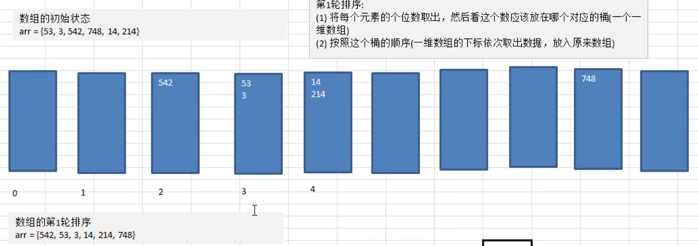
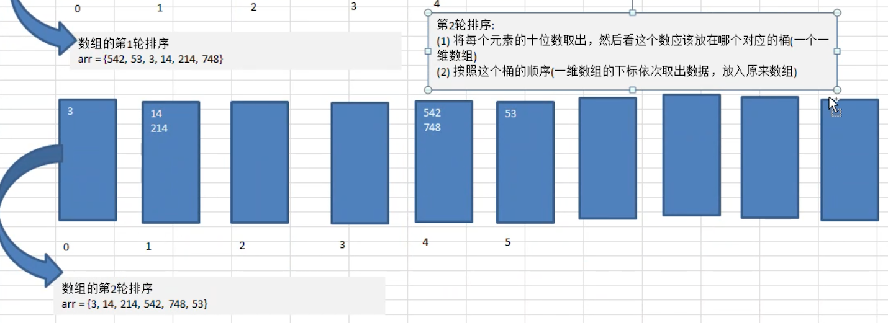
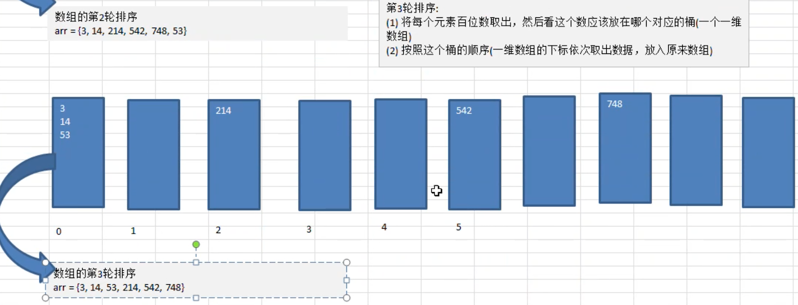

---
tags:
 - 基数排序
 - 桶排序
 - bucket sort
 - bin sort
---

# 基数排序

## 简单介绍

基数排序（radix sort）属于 **分配式排序**（distribution sort），又称 **桶子法**（bucket sort 或 bin sort），顾名思义，它是通过键值的各个位的值，将要排序的 **元素分配** 至某些「桶」中，达到排序的作用。

基数排序属于 **稳定性** 的排序，基数排序法是效率高的稳定性排序法。

::: tip 稳定性简介

2,1,43,1 数组进行排序后变成：1,1,2,43

稳定性指的是：两个 1 的先后顺序不改变。

:::

基数排序（Radix Sort）是 **桶排序** 的扩展。

基数排序是 1887 年赫尔曼·何乐礼发明的。实现方式：将整数按位数切割成不同的数字，然后按每个位数分别比较。

## 基本思想

1. 将所有待比较数值 **统一为同样的数位长度**，数位较短的数 **前面补零**
2. 然后从最低位开始，依次进行一次排序
3. 这样从最低位排序一直到最高位排序完成以后，序列就变成了一个有序序列

基本思想是抽象的，下面看看思路分析，你就明白是咋回事了。

## 思路分析

第一轮：比较 **个位数**

1. 将每个元素的 **个位数** 取出，然后放到对应的桶中（桶为一个一维数组）
2. 按照这个桶的顺序，依次取出数据，放回原来的数组

以上步骤中，每一轮除了比较的位数不同外，其他的都相同。



第二轮：比较 **十位数**。

需要注意的是：

- 第一轮使用后的桶并未清理，下图为了讲解方便，并未展示桶中已有的数据，不过会进行覆盖。
- 长度不足的数，用零表示。如 3，没有十位数，则归类到第一个桶中（0）。



第三轮：比较 **百位数**



对于最大值为 3 位数的数组中排序，你会发现，在第三轮排序后，数组已经是有序的了

## 代码实现

### 推导实现

```java
    /**
     * 推导：推导每一步的状态，然后找规律
     */
    @Test
    public void processDemo() {
        int arr[] = {53, 3, 542, 748, 14, 214};
        System.out.println("原始数组：" + Arrays.toString(arr));
        processRadixSort(arr);
    }

    public void processRadixSort(int[] arr) {
        // 第一轮
        // 1. 将每个元素的 个位数 取出，然后放到对应的桶中（桶为一个一维数组）
        // 2. 按照这个桶的顺序，依次取出数据，放回原来的数组

        // 定义 10 个桶，每个桶是一个一维数组
        // 由于无法知道每个桶需要多少个元素，所以声明为数组长度
        // 加入：10 个数字都是 1，那么只会分配到同一个通中
        int[][] buckets = new int[10][arr.length];
        // 定义每个桶中有效的数据个数
        // 桶长度为数组大小，那么每一个桶中存放了几个有效的元素呢？就需要有这个变量来指示
        int[] bucketCounts = new int[buckets.length];

        // 开始第一轮的代码实现
        // 1. 将每个元素的 个位数 取出，然后放到对应的桶中（桶为一个一维数组）
        for (int i = 0; i < arr.length; i++) {
            // 获取到个位数
            int temp = arr[i] % 10;
            // 根据规则，将该数放到对应的桶中
            buckets[temp][bucketCounts[temp]] = arr[i];
            // 并将该桶的有效个数+1
            bucketCounts[temp]++;
        }
        // 2. 按照这个桶的顺序，依次取出数据，放回原来的数组
        int index = 0; // 标识当前放回原数组的哪一个了
        for (int i = 0; i < buckets.length; i++) {
            if (bucketCounts[i] == 0) {
                // 标识该桶无数据
                continue;
            }
            for (int j = 0; j < bucketCounts[i]; j++) {
                arr[index++] = buckets[i][j];
            }
            // 取完数据后，要重置每个桶的有效数据个数
            bucketCounts[i] = 0;
        }
        System.out.println("第一轮排序后：" + Arrays.toString(arr));

        // 第 2 轮：比较十位数
        for (int i = 0; i < arr.length; i++) {
            // 获取到十位数
            int temp = arr[i] / 10 % 10;
            buckets[temp][bucketCounts[temp]] = arr[i];
            bucketCounts[temp]++;
        }
        index = 0; // 标识当前放回原数组的哪一个了
        for (int i = 0; i < buckets.length; i++) {
            if (bucketCounts[i] == 0) {
                continue;
            }
            for (int j = 0; j < bucketCounts[i]; j++) {
                arr[index++] = buckets[i][j];
            }
            bucketCounts[i] = 0;
        }
        System.out.println("第二轮排序后：" + Arrays.toString(arr));

        // 第 3 轮：比较百位数
        for (int i = 0; i < arr.length; i++) {
            // 获取到十位数
            int temp = arr[i] / 100 % 10;
            buckets[temp][bucketCounts[temp]] = arr[i];
            bucketCounts[temp]++;
        }
        index = 0; // 标识当前放回原数组的哪一个了
        for (int i = 0; i < buckets.length; i++) {
            if (bucketCounts[i] == 0) {
                continue;
            }
            for (int j = 0; j < bucketCounts[i]; j++) {
                arr[index++] = buckets[i][j];
            }
            bucketCounts[i] = 0;
        }
        System.out.println("第三轮排序后：" + Arrays.toString(arr));
    }
```

测试输出

```
原始数组：[53, 3, 542, 748, 14, 214]
第一轮排序后：[542, 53, 3, 14, 214, 748]
第二轮排序后：[3, 14, 214, 542, 748, 53]
第三轮排序后：[3, 14, 53, 214, 542, 748]
```

根据前面的推导，发现有如下的规律：整体代码比较固定，少数变量在变化

1. 要循环几轮？这个与待排序数组中的最大值有几位数有关系

   需要找到数组中的最大值，并且得到该值的位数

2. 获取个、十、百 位数的公式可以如下整理：

   ```
   // 获取个位数
   arr[i] % 10  -> arr[i] / 1 % 10
   // 获取十位数
   arr[i] / 10 % 10
   // 获取百位数
   arr[i] / 100 % 10
   ```

   可以发现规律，每一次变化的都是 10 的倍数

因此可以整理如下

### 完整实现

```java
    @Test
    public void radixSortTest() {
        int arr[] = {53, 3, 542, 748, 14, 214};
        System.out.println("原始数组：" + Arrays.toString(arr));
        radixSort(arr);
        System.out.println("排序后：" + Arrays.toString(arr));
    }

    /**
     * 根据推导规律，整理出完整算法
     *
     * @param arr
     */
    public void radixSort(int[] arr) {
        // 1. 得到数组中的最大值，并获取到该值的位数。用于循环几轮
        int max = arr[0];
        for (int i = 0; i < arr.length; i++) {
            if (arr[i] > max) {
                max = arr[i];
            }
        }
        // 得到位数
        int maxLength = (max + "").length();

        // 定义桶 和 标识桶中元素个数
        int[][] bucket = new int[10][arr.length];
        int[] bucketCounts = new int[bucket.length];

        // 总共需要进行 maxLength 轮
        for (int k = 1, n = 1; k <= maxLength; k++, n *= 10) {
            // 进行桶排序
            for (int i = 0; i < arr.length; i++) {
                // 获取该轮的桶索引：每一轮按 10 的倍数递增，获取到对应数位数
                // 这里额外使用一个步长为 10 的变量 n 来得到每一次递增后的值
                int bucketIndex = arr[i] / n % 10;
                // 放入该桶中
                bucket[bucketIndex][bucketCounts[bucketIndex]] = arr[i];
                // 标识该桶元素多了一个
                bucketCounts[bucketIndex]++;
            }
            // 将桶中元素获取出来，放到原数组中
            int index = 0;
            for (int i = 0; i < bucket.length; i++) {
                if (bucketCounts[i] == 0) {
                    // 该桶无有效元素，跳过不获取
                    continue;
                }
                // 获取桶中有效的个数
                for (int j = 0; j < bucketCounts[i]; j++) {
                    arr[index++] = bucket[i][j];
                }
                // 取完后，重置该桶的元素个数为 0 ，下一次才不会错乱数据
                bucketCounts[i] = 0;
            }
            System.out.println("第" + k + "轮排序后：" + Arrays.toString(arr));
        }
    }
```

测试输出

```
原始数组：[53, 3, 542, 748, 14, 214]
第1轮排序后：[542, 53, 3, 14, 214, 748]
第2轮排序后：[3, 14, 214, 542, 748, 53]
第3轮排序后：[3, 14, 53, 214, 542, 748]
排序后：[3, 14, 53, 214, 542, 748]
```

## 大数据量耗时测试

```java
 /**
     * 大量数据排序时间测试
     */
    @Test
    public void bulkDataSort() {
        int max = 80_000;
//        max = 8;
        int[] arr = new int[max];
        for (int i = 0; i < max; i++) {
            arr[i] = (int) (Math.random() * 80_000);
        }
        if (arr.length < 10) {
            System.out.println("原始数组：" + Arrays.toString(arr));
        }
        Instant startTime = Instant.now();
        radixSort(arr);
        if (arr.length < 10) {
            System.out.println("排序后：" + Arrays.toString(arr));
        }
        Instant endTime = Instant.now();
        System.out.println("共耗时：" + Duration.between(startTime, endTime).toMillis() + " 毫秒");
    }
```

多次测试输出信息

```
共耗时：31 毫秒
共耗时：29 毫秒
共耗时：22 毫秒
共耗时：39 毫秒
```

如果增加数据量到 800 万，也发现只会用时 400 毫秒左右，速度非常快。

但是，如果数据量增加到 8000 万，则会报错

```
java.lang.OutOfMemoryError: Java heap space

	at cn.mrcode.study.dsalgtutorialdemo.datastructure.sort.radix.RadixSortTest.radixSort(RadixSortTest.java:125)
```

这是为什么呢？原因就在于开启了 10 个桶，每个桶都是 8000 万个数据。那么换算下单位：

```bash
8000_0000 * 11 * 4 / 1024 /1024 / 1024 = 3.2 G 左右的堆空间
# 11 = 10 个桶 + 原始数组
# 4 ：一个 int 占用 4 字节
```

## 注意事项

- 基数排序是对 **传统桶排序** 的扩展，速度很快

- 是经典的空间换时间的方式，占用内存空间很大

  当数据量太大的时候，所耗费的额外空间较大。是原始数据的 10 倍空间

- 基数排序是稳定的

  相同的数，排序之后，他们的先后顺序没有发生变化。

- 有负数时，不用基数排序来进行排序

  如果要支持负数可以参考 [中文维基百科](https://code.i-harness.com/zh-CN/q/e98fa9)

  由于上述算法使用的按位比较，并未考虑负数，直接使用，将导致数组越界。

  改造支持负数的核心思想是：将负数取绝对值，然后再反转成负数。

