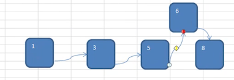
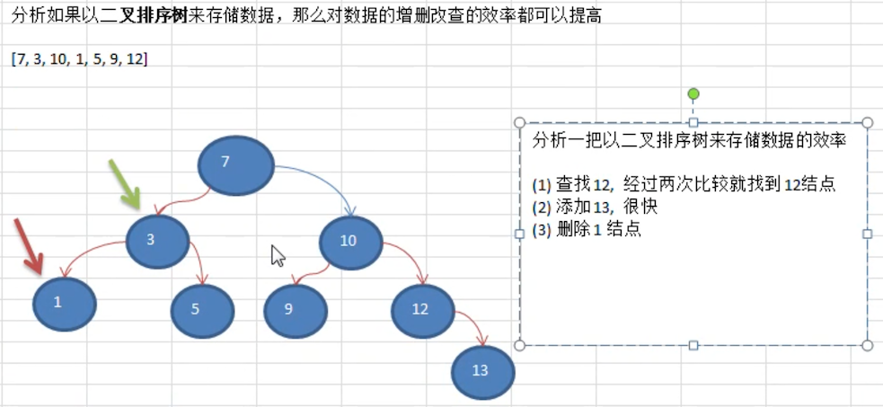
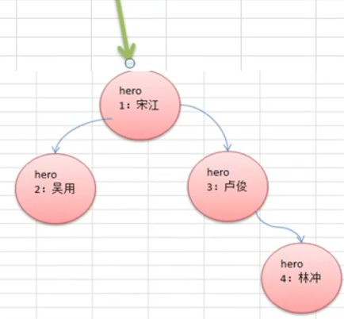

# 二叉树

## 为什么需要该数据结构

### 数组存储方式的分析

- 优点：
  -  通过 **下标** 方式访问元素，速度快
  - 对于 **有序数组**，还可以使用二分查找提高检索速度
- 缺点：如果要检索具体某个值或插入值（按一定顺序）会整体移动，效率较低，如下的示意图


### 链表存储方式的分析

- 优点：在一定程度上对数组存储方式有优化

  例如：插入一个数值节点，只需要将插入节点，链接到链表中即可，同理，删除效率也很好

  

- 缺点：检索效率较低

  需要从头结点开始遍历查找。 

简单说：

- 数组访问快，增删慢
- 链表增删快，访问慢

那么就出现了 **树** 这种数据结构

### 树存储数据方式分析

提供数据 **存储** 、**读取** 效率。

例如：利用 **二叉排序树（Binary Sort Tree）**，既可以保证数据的检索速度，同时也可以保证数据的**插入**、**删除**、**修改**  的速度



如图所示：

- 插入时，小的数在 **左节点**、大的数在 **右节点**
- 查找时：根据插入事的特性，基本上就类似折半查找了，每次都过滤一半的节点
- 删除时：只需要移动相邻的节点的引用

## 树的常用术语


- 节点：每一个圆圈表示一个节点，也称节点对象

- 根节点：最上面，最顶部的那个节点，也就是一棵树的入口

- 父节点：有子节点的节点

- 子节点

- 叶子节点：没有子节点的节点

- 节点的权：可以简单的理解为节点值

  有时候也用 **路径** 来表示

- 路径：从 root 节点找到该节点的路线

- 层

- 子树：有子节点的父子两层就可以称为是一个子树

- 树的高度：最大层数

- 森林：多颗子树构成森林

## 二叉树的概念

- 树有很多种，每个节点 **最多只能有两个子节点** 的一种形式称为 **二叉树**

- 二叉树的子节点分为 **左节点** 和 **右节点**

  

- 如果该二叉树的所有 **叶子节点** 都在 **最后一层**，并且 **节点总数 =**  2<sup>n-1</sup> （n 为层数），则我们称为 **满二叉树**

  

- 如果该二叉树的所有叶子节点都在最 **后一层或倒数第二层**，而且 **最后一层的叶子节点在左边连续**，**倒数第二层的叶子节点在右边连续**，我们称为 **完全二叉树**

  

## 二叉树的遍历说明

有三种：

- 前序遍历：**先输出父节点**，再遍历左子树和右子树
- 中序遍历：先遍历左子树，**再输出父节点**，再遍历右子树
- 后序遍历：先遍历左子树，再遍历右子树，**最后输出父节点**

看上述粗体部分：前中后说的就是父节点的输出时机。

## 二叉树遍历思路分析



- 前序遍历：

  1. 先输出当前节点（初始节点是 root 节点）
  2. 如果左子节点不为空，则递归继续前序遍历
  3. 如果右子节点不为空，则递归继续前序遍历

  上图的输出顺序为：1、2、3、4

- 中序遍历：

  1. 如果当前节点的左子节点不为空，则递归中序遍历
  2. 输出当前节点
  3. 如果当前节点的右子节点不为空，则递归中序

  上图的输出顺序为：2、1、4、3

- 后序遍历：

  1. 如果左子节点不为空，则递归继续前序遍历
  2. 如果右子节点不为空，则递归继续前序遍历
  3. 输出当前节点

  上图的输出顺序为：2、4、3、1

## 二叉树遍历代码实现

```java
package cn.mrcode.study.dsalgtutorialdemo.datastructure.tree;

import org.junit.Test;

/**
 * 二叉树测试
 */
public class BinaryTreeTest {

    // 先编写二叉树节点
    class HeroNode {
        public int id;
        public String name;
        public HeroNode left;
        public HeroNode right;

        public HeroNode(int id, String name) {
            this.id = id;
            this.name = name;
        }

        @Override
        public String toString() {
            return "HeroNode{" +
                    "id=" + id +
                    ", name='" + name + '\'' +
                    '}';
        }

        /**
         * 前序遍历
         */
        public void preOrder() {
            // 1. 先输出当前节点
            System.out.println(this);
            // 2. 如果左子节点不为空，则递归继续前序遍历
            if (this.left != null) {
                this.left.preOrder();
            }
            // 3. 如果右子节点不为空，则递归继续前序遍历
            if (this.right != null) {
                this.right.preOrder();
            }
        }

        /**
         * 中序遍历
         */
        public void infixOrder() {
            // 1. 如果左子节点不为空，则递归继续前序遍历
            if (this.left != null) {
                this.left.infixOrder();
            }
            // 2. 先输出当前节点
            System.out.println(this);

            // 3. 如果右子节点不为空，则递归继续前序遍历
            if (this.right != null) {
                this.right.infixOrder();
            }
        }

        /**
         * 后序遍历
         */
        public void postOrder() {
            // 1. 如果左子节点不为空，则递归继续前序遍历
            if (this.left != null) {
                this.left.postOrder();
            }
            // 2. 如果右子节点不为空，则递归继续前序遍历
            if (this.right != null) {
                this.right.postOrder();
            }
            // 3. 先输出当前节点
            System.out.println(this);
        }
    }

    // 编写二叉树对象
    class BinaryTree {
        public HeroNode root;

        /**
         * 前序遍历
         */
        public void preOrder() {
            if (root == null) {
                System.out.println("二叉树为空");
                return;
            }
            root.preOrder();
        }

        /**
         * 中序遍历
         */
        public void infixOrder() {
            if (root == null) {
                System.out.println("二叉树为空");
                return;
            }
            root.infixOrder();
        }

        /**
         * 后续遍历
         */
        public void postOrder() {
            if (root == null) {
                System.out.println("二叉树为空");
                return;
            }
            root.postOrder();
        }
    }

    // 编写二叉树对象

    /**
     * 前、中、后 遍历测试
     */
    @Test
    public void fun1() {
        // 创建节点与构建二叉树
        HeroNode n1 = new HeroNode(1, "宋江");
        HeroNode n2 = new HeroNode(2, "无用");
        HeroNode n3 = new HeroNode(3, "卢俊");
        HeroNode n4 = new HeroNode(4, "林冲");
        n1.left = n2;
        n1.right = n3;
        n3.right = n4;
        BinaryTree binaryTree = new BinaryTree();
        binaryTree.root = n1;

        System.out.println("\n 前序遍历：");
        binaryTree.preOrder();
        System.out.println("\n 中序遍历：");
        binaryTree.infixOrder();
        System.out.println("\n 后序遍历：");
        binaryTree.postOrder();
    }

}
```

测试输出

```
 前序遍历：
HeroNode{id=1, name='宋江'}
HeroNode{id=2, name='无用'}
HeroNode{id=3, name='卢俊'}
HeroNode{id=4, name='林冲'}

 中序遍历：
HeroNode{id=2, name='无用'}
HeroNode{id=1, name='宋江'}
HeroNode{id=3, name='卢俊'}
HeroNode{id=4, name='林冲'}

 后序遍历：
HeroNode{id=2, name='无用'}
HeroNode{id=4, name='林冲'}
HeroNode{id=3, name='卢俊'}
HeroNode{id=1, name='宋江'}
```

那么现在来考考你：


给 **卢俊义** 增加一个节点 **关胜**，写出他的前、中、后序的打印顺序：

注意的是：上面这个新增的节点，并不是按照顺序增加的，这里考的知识点是 **前、中、后序的遍历规则**

- 前序：1、2、3、5、4

- 中序：2、1、5、3，4

- 后序：2、1、5、4、3  `-> 正确答案为：` 2、5、4、3、1

  通过后面的程序检测，发现这里的确是答案错误了！

那么下面通过程序来检测答案是否正确：

```java
    /**
     * 考题：给卢俊新增一个 left 节点，然后打印前、中、后 遍历顺序
     */
    @Test
    public void fun2() {
        // 创建节点与构建二叉树
        HeroNode n1 = new HeroNode(1, "宋江");
        HeroNode n2 = new HeroNode(2, "无用");
        HeroNode n3 = new HeroNode(3, "卢俊");
        HeroNode n4 = new HeroNode(4, "林冲");
        HeroNode n5 = new HeroNode(5, "关胜");
        n1.left = n2;
        n1.right = n3;
        n3.right = n4;
        n3.left = n5;
        BinaryTree binaryTree = new BinaryTree();
        binaryTree.root = n1;

        System.out.println("\n 前序遍历：");
        binaryTree.preOrder();
        System.out.println("\n 中序遍历：");
        binaryTree.infixOrder();
        System.out.println("\n 后序遍历：");
        binaryTree.postOrder();
    }
```

输出信息

```
 前序遍历：
HeroNode{id=1, name='宋江'}
HeroNode{id=2, name='无用'}
HeroNode{id=3, name='卢俊'}
HeroNode{id=5, name='关胜'}
HeroNode{id=4, name='林冲'}

 中序遍历：
HeroNode{id=2, name='无用'}
HeroNode{id=1, name='宋江'}
HeroNode{id=5, name='关胜'}
HeroNode{id=3, name='卢俊'}
HeroNode{id=4, name='林冲'}

 后序遍历：
HeroNode{id=2, name='无用'}
HeroNode{id=5, name='关胜'}
HeroNode{id=4, name='林冲'}
HeroNode{id=3, name='卢俊'}
HeroNode{id=1, name='宋江'}
```

可以看到，后序是最容易弄错的规则，所以在后续上，一定要多多 debug ，看下他的调用轨迹。

## 二叉树的查找

要求：

1. 编写前、中、后序查找方法
2. 并分别使用三种查找方式，查找 `id=5` 的节点
3. 并分析各种查找方式，分别比较了多少次

由于二叉树的查找是遍历查找，所以就简单了，前面遍历规则已经写过了，改写成查找即可

```java
package cn.mrcode.study.dsalgtutorialdemo.datastructure.tree;

import org.junit.Test;

/**
 * 二叉树测试
 */
public class BinaryTreeTest {

    // 先编写二叉树节点
    class HeroNode {
        public int id;
        public String name;
        public HeroNode left;
        public HeroNode right;

        public HeroNode(int id, String name) {
            this.id = id;
            this.name = name;
        }

        @Override
        public String toString() {
            return "HeroNode{" +
                    "id=" + id +
                    ", name='" + name + '\'' +
                    '}';
        }

        /**
         * 前序遍历
         */
        public void preOrder() {
            // 1. 先输出当前节点
            System.out.println(this);
            // 2. 如果左子节点不为空，则递归继续前序遍历
            if (this.left != null) {
                this.left.preOrder();
            }
            // 3. 如果右子节点不为空，则递归继续前序遍历
            if (this.right != null) {
                this.right.preOrder();
            }
        }

        /**
         * 中序遍历
         */
        public void infixOrder() {
            // 1. 如果左子节点不为空，则递归继续前序遍历
            if (this.left != null) {
                this.left.infixOrder();
            }
            // 2. 先输出当前节点
            System.out.println(this);

            // 3. 如果右子节点不为空，则递归继续前序遍历
            if (this.right != null) {
                this.right.infixOrder();
            }
        }

        /**
         * 后序遍历
         */
        public void postOrder() {
            // 1. 如果左子节点不为空，则递归继续前序遍历
            if (this.left != null) {
                this.left.postOrder();
            }
            // 2. 如果右子节点不为空，则递归继续前序遍历
            if (this.right != null) {
                this.right.postOrder();
            }
            // 3. 先输出当前节点
            System.out.println(this);
        }

        /**
         * 前序查找
         */
        public HeroNode preOrderSearch(int id) {
            System.out.println("  进入前序遍历");  // 用来统计查找了几次
            // 1. 如何相等，则返回
            if (this.id == id) {
                return this;
            }
            // 2. 如果左子节点不为空，则递归继续前序遍历
            if (this.left != null) {
                HeroNode result = this.left.preOrderSearch(id);
                if (result != null) {
                    return result;
                }
            }
            // 3. 如果右子节点不为空，则递归继续前序遍历
            if (this.right != null) {
                HeroNode result = this.right.preOrderSearch(id);
                if (result != null) {
                    return result;
                }
            }
            return null;
        }

        /**
         * 中序查找
         */
        public HeroNode infixOrderSearch(int id) {
//            System.out.println("  进入中序遍历");  // 用来统计查找了几次，不能在这里打印，这里打印是进入了方法几次，看的是比较了几次
            // 1. 如果左子节点不为空，则递归继续前序遍历
            if (this.left != null) {
                HeroNode result = this.left.infixOrderSearch(id);
                if (result != null) {
                    return result;
                }
            }
            System.out.println("  进入中序遍历");
            // 2. 如果相等，则返回
            if (this.id == id) {
                return this;
            }

            // 3. 如果右子节点不为空，则递归继续前序遍历
            if (this.right != null) {
                HeroNode result = this.right.infixOrderSearch(id);
                if (result != null) {
                    return result;
                }
            }
            return null;
        }

        /**
         * 后序查找
         */
        public HeroNode postOrderSearch(int id) {
//            System.out.println("  进入后序遍历");  // 用来统计查找了几次，不能在这里打印，这里打印是进入了方法几次，看的是比较了几次
            // 1. 如果左子节点不为空，则递归继续前序遍历
            if (this.left != null) {
                HeroNode result = this.left.postOrderSearch(id);
                if (result != null) {
                    return result;
                }
            }
            // 2. 如果右子节点不为空，则递归继续前序遍历
            if (this.right != null) {
                HeroNode result = this.right.postOrderSearch(id);
                if (result != null) {
                    return result;
                }
            }
            System.out.println("  进入后序遍历");
            // 3. 如果相等，则返回
            if (this.id == id) {
                return this;
            }
            return null;
        }
    }

    // 编写二叉树对象
    class BinaryTree {
        public HeroNode root;

        /**
         * 前序遍历
         */
        public void preOrder() {
            if (root == null) {
                System.out.println("二叉树为空");
                return;
            }
            root.preOrder();
        }

        /**
         * 中序遍历
         */
        public void infixOrder() {
            if (root == null) {
                System.out.println("二叉树为空");
                return;
            }
            root.infixOrder();
        }

        /**
         * 后续遍历
         */
        public void postOrder() {
            if (root == null) {
                System.out.println("二叉树为空");
                return;
            }
            root.postOrder();
        }

        /**
         * 前序查找
         */
        public HeroNode preOrderSearch(int id) {
            if (root == null) {
                System.out.println("二叉树为空");
                return null;
            }
            return root.preOrderSearch(id);
        }

        /**
         * 中序查找
         */
        public HeroNode infixOrderSearch(int id) {
            if (root == null) {
                System.out.println("二叉树为空");
                return null;
            }
            return root.infixOrderSearch(id);
        }

        /**
         * 后序查找
         */
        public HeroNode postOrderSearch(int id) {
            if (root == null) {
                System.out.println("二叉树为空");
                return null;
            }
            return root.postOrderSearch(id);
        }
    }

    


    /**
     * 查找 id=5 的前、中、后序测试
     */
    @Test
    public void fun3() {
        // 创建节点与构建二叉树
        HeroNode n1 = new HeroNode(1, "宋江");
        HeroNode n2 = new HeroNode(2, "无用");
        HeroNode n3 = new HeroNode(3, "卢俊");
        HeroNode n4 = new HeroNode(4, "林冲");
        HeroNode n5 = new HeroNode(5, "关胜");
        n1.left = n2;
        n1.right = n3;
        n3.right = n4;
        n3.left = n5;
        BinaryTree binaryTree = new BinaryTree();
        binaryTree.root = n1;

        System.out.println("找到测试：");
        int id = 5;
        System.out.println("\n前序遍历查找 id=" + id);
        System.out.println(binaryTree.preOrderSearch(id));
        System.out.println("\n中序遍历查找 id=" + id);
        System.out.println(binaryTree.infixOrderSearch(id));
        System.out.println("\n后序遍历查找 id=" + id);
        System.out.println(binaryTree.postOrderSearch(id));

        System.out.println("找不到测试：");
        id = 15;
        System.out.println("\n前序遍历查找 id=" + id);
        System.out.println(binaryTree.preOrderSearch(id));
        System.out.println("\n中序遍历查找 id=" + id);
        System.out.println(binaryTree.infixOrderSearch(id));
        System.out.println("\n后序遍历查找 id=" + id);
        System.out.println(binaryTree.postOrderSearch(id));
    }
}

```

测试输出

```bash
找到测试：

前序遍历查找 id=5   # 共查找 4 次
  进入前序遍历
  进入前序遍历
  进入前序遍历
  进入前序遍历
HeroNode{id=5, name='关胜'}

中序遍历查找 id=5  # 共查找 3 次
  进入中序遍历
  进入中序遍历
  进入中序遍历
HeroNode{id=5, name='关胜'}

后序遍历查找 id=5  # 共查找 2 次
  进入后序遍历
  进入后序遍历
HeroNode{id=5, name='关胜'}
找不到测试：

前序遍历查找 id=15
  进入前序遍历
  进入前序遍历
  进入前序遍历
  进入前序遍历
  进入前序遍历
null

中序遍历查找 id=15
  进入中序遍历
  进入中序遍历
  进入中序遍历
  进入中序遍历
  进入中序遍历
null

后序遍历查找 id=15
  进入后序遍历
  进入后序遍历
  进入后序遍历
  进入后序遍历
  进入后序遍历
null
```

可以看出：

- 找到的次数和 **查找的顺序** 有关，而查找顺序就是哪一序有关
- 找不到的次数则是相当于都遍历完成，所以是相等的次数

## 二叉树的删除


要求：

1. 如果删除的节点是 **叶子节点**，则删除该节点
2. 如果删除的节点是非叶子节点，则删除该子树

测试：删除 5 号叶子节点和 3 号子树。

说明：目前的二叉树不是规则的，如果不删除子树，则需要考虑哪一个节点会被上提作为父节点。这个后续讲解排序二叉树时再来实现。先实现简单的

思路分析：

- 由于我们的二叉树是单向的

- 所以我们判定一个节点是否可以删除，是判断它的 **子节点**，是否可删除，否则则没法回到父节点删除了，因为要判断被删除的节点满足前面的两点要求

  1. 当前节点的 **左子节点** 不为空，并且左子节点就是要删除的节点，则 left = null，并且返回（结束递归删除）
  2. 当前节点的 **右子节点** 不为空，并且右子节点就是要删除的节点，则 right = null，并且返回（结束递归删除）

  如果前面都没有删除，则继续递归删除。上面的要求是 2 点，实际上是，找到符合条件的节点则直接删除（因为不考虑是否有子树）

  如果树只有一个 root 节点，则将 root 节点置空

```java
// BinaryTree 新增删除方法

 /**
 * 删除节点
 *
 * @param id
 * @return
 */
public HeroNode delete(int id) {
  if (root == null) {
    System.out.println("树为空");
    return null;
  }
  HeroNode target = null;
  // 树只有 root 节点，则直接置空
  if (root.id == id) {
    target = root;
    root = null;
  } else {
    target = this.root.delete(id);
  }

  return target;
}
```

```java
// HeroNode 中新增删除方法

/**
* 删除节点，老师的思路写法，先看左右，看完再递归
* @param id
* @return 如果删除成功，则返回删除的节点
*/
public HeroNode delete(int id) {
  // 判断左子节点是否是要删除的节点
  HeroNode target = null;
  if (this.left != null && this.left.id == id) {
    target = this.left;
    this.left = null;
    return target;
  }

  if (this.right != null && this.right.id == id) {
    target = this.right;
    this.right = null;
    return target;
  }

  // 尝试左递归
  if (this.left != null) {
    target = this.left.delete(id);
    if (target != null) {
      return target;
    }
  }

  // 尝试右递归
  if (this.right != null) {
    target = this.right.delete(id);
    if (target != null) {
      return target;
    }
  }
  return null;
}
```

删除方法测试用例

```java
    /**
     * 构建当前这个树
     *
     * @return
     */
    private BinaryTree buildBinaryTree() {
        HeroNode n1 = new HeroNode(1, "宋江");
        HeroNode n2 = new HeroNode(2, "无用");
        HeroNode n3 = new HeroNode(3, "卢俊");
        HeroNode n4 = new HeroNode(4, "林冲");
        HeroNode n5 = new HeroNode(5, "关胜");
        n1.left = n2;
        n1.right = n3;
        n3.right = n4;
        n3.left = n5;
        BinaryTree binaryTree = new BinaryTree();
        binaryTree.root = n1;
        return binaryTree;
    }

    @Test
    public void delete3() {
        // 创建节点与构建二叉树
        BinaryTree binaryTree = buildBinaryTree();
        binaryTree.preOrder();

        // 删除 3 号节点
        HeroNode target = binaryTree.delete(3);
        String msg = (target == null ? "删除失败，未找到" : "删除成功：" + target.toString());
        System.out.println(msg);
        binaryTree.preOrder();
    }


    @Test
    public void delete5() {
        // 创建节点与构建二叉树
        BinaryTree binaryTree = buildBinaryTree();
        binaryTree.preOrder();

        // 删除 5 号节点
        HeroNode target = binaryTree.delete(5);
        String msg = (target == null ? "删除失败，未找到" : "删除成功：" + target.toString());
        System.out.println(msg);
        binaryTree.preOrder();
    }

    /**
     * 删除一个不存在的节点
     */
    @Test
    public void deleteFail() {
        // 创建节点与构建二叉树
        BinaryTree binaryTree = buildBinaryTree();
        binaryTree.preOrder();

        // 删除 5 号节点
        HeroNode target = binaryTree.delete(9);
        String msg = (target == null ? "删除失败，未找到" : "删除成功：" + target.toString());
        System.out.println(msg);
        binaryTree.preOrder();
    }

    /**
     * 删除 root 节点
     */
    @Test
    public void deleteRoot() {
        // 创建节点与构建二叉树
        BinaryTree binaryTree = buildBinaryTree();
        binaryTree.preOrder();

        // 删除 1 号节点
        HeroNode target = binaryTree.delete(1);
        String msg = (target == null ? "删除失败，未找到" : "删除成功：" + target.toString());
        System.out.println(msg);
        binaryTree.preOrder();
    }
```

分别输出信息如下

```
#==== delete3 输出信息
HeroNode{id=1, name='宋江'}
HeroNode{id=2, name='无用'}
HeroNode{id=3, name='卢俊'}
HeroNode{id=5, name='关胜'}
HeroNode{id=4, name='林冲'}
删除成功：HeroNode{id=3, name='卢俊'}
HeroNode{id=1, name='宋江'}
HeroNode{id=2, name='无用'}

#==== delete5 输出信息
HeroNode{id=1, name='宋江'}
HeroNode{id=2, name='无用'}
HeroNode{id=3, name='卢俊'}
HeroNode{id=5, name='关胜'}
HeroNode{id=4, name='林冲'}
删除成功：HeroNode{id=5, name='关胜'}
HeroNode{id=1, name='宋江'}
HeroNode{id=2, name='无用'}
HeroNode{id=3, name='卢俊'}
HeroNode{id=4, name='林冲'}

#==== deleteFail 输出信息
HeroNode{id=1, name='宋江'}
HeroNode{id=2, name='无用'}
HeroNode{id=3, name='卢俊'}
HeroNode{id=5, name='关胜'}
HeroNode{id=4, name='林冲'}
删除失败，未找到
HeroNode{id=1, name='宋江'}
HeroNode{id=2, name='无用'}
HeroNode{id=3, name='卢俊'}
HeroNode{id=5, name='关胜'}
HeroNode{id=4, name='林冲'}

#==== deleteRoot 输出信息
HeroNode{id=1, name='宋江'}
HeroNode{id=2, name='无用'}
HeroNode{id=3, name='卢俊'}
HeroNode{id=5, name='关胜'}
HeroNode{id=4, name='林冲'}
删除成功：HeroNode{id=1, name='宋江'}
二叉树为空
```

