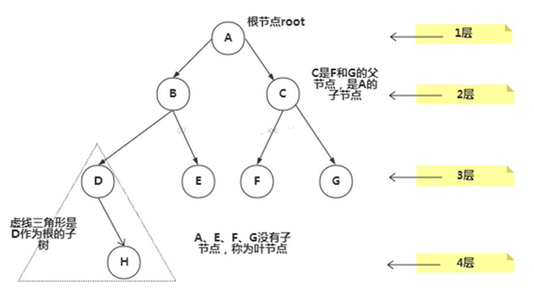
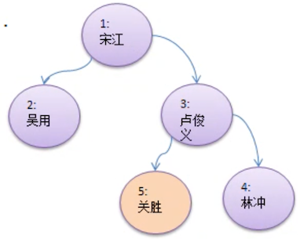

# 二叉树

## 为什么需要该数据结构

### 数组存储方式的分析

- 优点：
  -  通过 **下标** 方式访问元素，速度快
  - 对于 **有序数组**，还可以使用二分查找提高检索速度
- 缺点：如果要检索具体某个值或插入值（按一定顺序）会整体移动，效率较低，如下的示意图


### 链表存储方式的分析

- 优点：在一定程度上对数组存储方式有优化

  例如：插入一个数值节点，只需要将插入节点，链接到链表中即可，同理，删除效率也很好

  

- 缺点：检索效率较低

  需要从头结点开始遍历查找。 

简单说：

- 数组访问快，增删慢
- 链表增删快，访问慢

那么就出现了 **树** 这种数据结构

### 树存储数据方式分析

提供数据 **存储** 、**读取** 效率。

例如：利用 **二叉排序树（Binary Sort Tree）**，既可以保证数据的检索速度，同时也可以保证数据的**插入**、**删除**、**修改**  的速度


如图所示：

- 插入时，小的数在 **左节点**、大的数在 **右节点**
- 查找时：根据插入事的特性，基本上就类似折半查找了，每次都过滤一半的节点
- 删除时：只需要移动相邻的节点的引用

## 树的常用术语



- 节点：每一个圆圈表示一个节点，也称节点对象

- 根节点：最上面，最顶部的那个节点，也就是一棵树的入口

- 父节点：有子节点的节点

- 子节点

- 叶子节点：没有子节点的节点

- 节点的权：可以简单的理解为节点值

  有时候也用 **路径** 来表示

- 路径：从 root 节点找到该节点的路线

- 层

- 子树：有子节点的父子两层就可以称为是一个子树

- 树的高度：最大层数

- 森林：多颗子树构成森林

## 二叉树的概念

- 树有很多种，每个节点 **最多只能有两个子节点** 的一种形式称为 **二叉树**

- 二叉树的子节点分为 **左节点** 和 **右节点**

  

- 如果该二叉树的所有 **叶子节点** 都在 **最后一层**，并且 **节点总数 =**  2<sup>n-1</sup> （n 为层数），则我们称为 **满二叉树**

  

- 如果该二叉树的所有叶子节点都在最 **后一层或倒数第二层**，而且 **最后一层的叶子节点在左边连续**，**倒数第二层的叶子节点在右边连续**，我们称为 **完全二叉树**

  

## 二叉树的遍历说明

有三种：

- 前序遍历：**先输出父节点**，再遍历左子树和右子树
- 中序遍历：先遍历左子树，**再输出父节点**，再遍历右子树
- 后序遍历：先遍历左子树，再遍历右子树，**最后输出父节点**

看上述粗体部分：前中后说的就是父节点的输出时机。

## 二叉树遍历思路分析


- 前序遍历：

  1. 先输出当前节点（初始节点是 root 节点）
  2. 如果左子节点不为空，则递归继续前序遍历
  3. 如果右子节点不为空，则递归继续前序遍历

  上图的输出顺序为：1、2、3、4

- 中序遍历：

  1. 如果当前节点的左子节点不为空，则递归中序遍历
  2. 输出当前节点
  3. 如果当前节点的右子节点不为空，则递归中序

  上图的输出顺序为：2、1、4、3

- 后序遍历：

  1. 如果左子节点不为空，则递归继续前序遍历
  2. 如果右子节点不为空，则递归继续前序遍历
  3. 输出当前节点

  上图的输出顺序为：2、4、3、1

## 二叉树遍历代码实现

```java
package cn.mrcode.study.dsalgtutorialdemo.datastructure.tree;

import org.junit.Test;

/**
 * 二叉树测试
 */
public class BinaryTreeTest {

    // 先编写二叉树节点
    class HeroNode {
        public int id;
        public String name;
        public HeroNode left;
        public HeroNode right;

        public HeroNode(int id, String name) {
            this.id = id;
            this.name = name;
        }

        @Override
        public String toString() {
            return "HeroNode{" +
                    "id=" + id +
                    ", name='" + name + '\'' +
                    '}';
        }

        /**
         * 前序遍历
         */
        public void preOrder() {
            // 1. 先输出当前节点
            System.out.println(this);
            // 2. 如果左子节点不为空，则递归继续前序遍历
            if (this.left != null) {
                this.left.preOrder();
            }
            // 3. 如果右子节点不为空，则递归继续前序遍历
            if (this.right != null) {
                this.right.preOrder();
            }
        }

        /**
         * 中序遍历
         */
        public void infixOrder() {
            // 1. 如果左子节点不为空，则递归继续前序遍历
            if (this.left != null) {
                this.left.infixOrder();
            }
            // 2. 先输出当前节点
            System.out.println(this);

            // 3. 如果右子节点不为空，则递归继续前序遍历
            if (this.right != null) {
                this.right.infixOrder();
            }
        }

        /**
         * 后序遍历
         */
        public void postOrder() {
            // 1. 如果左子节点不为空，则递归继续前序遍历
            if (this.left != null) {
                this.left.postOrder();
            }
            // 2. 如果右子节点不为空，则递归继续前序遍历
            if (this.right != null) {
                this.right.postOrder();
            }
            // 3. 先输出当前节点
            System.out.println(this);
        }
    }

    // 编写二叉树对象
    class BinaryTree {
        public HeroNode root;

        /**
         * 前序遍历
         */
        public void preOrder() {
            if (root == null) {
                System.out.println("二叉树为空");
                return;
            }
            root.preOrder();
        }

        /**
         * 中序遍历
         */
        public void infixOrder() {
            if (root == null) {
                System.out.println("二叉树为空");
                return;
            }
            root.infixOrder();
        }

        /**
         * 后续遍历
         */
        public void postOrder() {
            if (root == null) {
                System.out.println("二叉树为空");
                return;
            }
            root.postOrder();
        }
    }

    // 编写二叉树对象

    /**
     * 前、中、后 遍历测试
     */
    @Test
    public void fun1() {
        // 创建节点与构建二叉树
        HeroNode n1 = new HeroNode(1, "宋江");
        HeroNode n2 = new HeroNode(2, "无用");
        HeroNode n3 = new HeroNode(3, "卢俊");
        HeroNode n4 = new HeroNode(4, "林冲");
        n1.left = n2;
        n1.right = n3;
        n3.right = n4;
        BinaryTree binaryTree = new BinaryTree();
        binaryTree.root = n1;

        System.out.println("\n 前序遍历：");
        binaryTree.preOrder();
        System.out.println("\n 中序遍历：");
        binaryTree.infixOrder();
        System.out.println("\n 后序遍历：");
        binaryTree.postOrder();
    }

}
```

测试输出

```
 前序遍历：
HeroNode{id=1, name='宋江'}
HeroNode{id=2, name='无用'}
HeroNode{id=3, name='卢俊'}
HeroNode{id=4, name='林冲'}

 中序遍历：
HeroNode{id=2, name='无用'}
HeroNode{id=1, name='宋江'}
HeroNode{id=3, name='卢俊'}
HeroNode{id=4, name='林冲'}

 后序遍历：
HeroNode{id=2, name='无用'}
HeroNode{id=4, name='林冲'}
HeroNode{id=3, name='卢俊'}
HeroNode{id=1, name='宋江'}
```

那么现在来考考你：



给 **卢俊义** 增加一个节点 **关胜**，写出他的前、中、后序的打印顺序：

注意的是：上面这个新增的节点，并不是按照顺序增加的，这里考的知识点是 **前、中、后序的遍历规则**

- 前序：1、2、3、5、4

- 中序：2、1、5、3，4

- 后序：2、1、5、4、3  `-> 正确答案为：` 2、5、4、3、1

  通过后面的程序检测，发现这里的确是答案错误了！

那么下面通过程序来检测答案是否正确：

```java
    /**
     * 考题：给卢俊新增一个 left 节点，然后打印前、中、后 遍历顺序
     */
    @Test
    public void fun2() {
        // 创建节点与构建二叉树
        HeroNode n1 = new HeroNode(1, "宋江");
        HeroNode n2 = new HeroNode(2, "无用");
        HeroNode n3 = new HeroNode(3, "卢俊");
        HeroNode n4 = new HeroNode(4, "林冲");
        HeroNode n5 = new HeroNode(5, "关胜");
        n1.left = n2;
        n1.right = n3;
        n3.right = n4;
        n3.left = n5;
        BinaryTree binaryTree = new BinaryTree();
        binaryTree.root = n1;

        System.out.println("\n 前序遍历：");
        binaryTree.preOrder();
        System.out.println("\n 中序遍历：");
        binaryTree.infixOrder();
        System.out.println("\n 后序遍历：");
        binaryTree.postOrder();
    }
```

输出信息

```
 前序遍历：
HeroNode{id=1, name='宋江'}
HeroNode{id=2, name='无用'}
HeroNode{id=3, name='卢俊'}
HeroNode{id=5, name='关胜'}
HeroNode{id=4, name='林冲'}

 中序遍历：
HeroNode{id=2, name='无用'}
HeroNode{id=1, name='宋江'}
HeroNode{id=5, name='关胜'}
HeroNode{id=3, name='卢俊'}
HeroNode{id=4, name='林冲'}

 后序遍历：
HeroNode{id=2, name='无用'}
HeroNode{id=5, name='关胜'}
HeroNode{id=4, name='林冲'}
HeroNode{id=3, name='卢俊'}
HeroNode{id=1, name='宋江'}
```

可以看到，后序是最容易弄错的规则，所以在后续上，一定要多多 debug ，看下他的调用轨迹。

