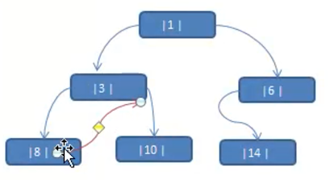

# 线索化二叉树

## 引出线索化二叉树

看如下问题：将数列 `{1,3,6,8,10,14}` 构成一颗二叉树

可以看到上图的二叉树为一颗 **完全二叉树**。对他进行分析，可以发现如下的一些问题：

1. 当对上面的二叉树进行中序遍历时，数列为 `8,3,10,1,14,6`
2. 但是  `6,8,10,14` 这几个节点的左右指针，并没有完全用上

如果希望充分利用各个节点的左右指针，让各个节点可以 **指向自己的前后节点**，这个时候就可以使用 **线索化二叉树** 了

## 介绍

n 个节点的二叉树链表中含有 `n + 1` 个空指针域，他的推导公式为 `2n-(n-1) = n + 1`。

利用二叉链表中的空指针域，存放指向该节点在 **某种遍历次序 **下的 **前驱** 和 **后继** 节点的指针，这种附加的指针称为**「线索」**

- 前驱：一个节点的前一个节点
- 后继：一个节点的后一个节点

如下图，在中序遍历中，下图的中序遍历为 `8,3,10,1,14,6`，那么 8 的后继节点就为 3，3 的后继节点是 10

这种加上了线索的二叉树链表称为 **线索链表**（节点存储了下一个节点，组成了链表，并且一般的二叉树本来就是用链表实现的），相应的二叉树称为 **线索二叉树（Threaded BinaryTree）**。根据线索性质的不同，线索二叉树可分为：前、中、后序线索二叉树。

## 思路分析

将上图的二叉树，进行 **中序线索二叉树**，中序遍历的数列为 `8,3,10,1,14,6`。

那么以上图为例，线索化二叉树后的样子如下图

- 8 的后继节点为 3
- 3 由于 **左右节点都有元素，不能线索化**
- 10 的前驱节点为 3，后继节点为 1
- 1 不能线索化
- 14 的前驱节点为 1，后继节点为 6
- 6 有左节点，不能线索化

注意：当线索化二叉树后，那么一个 Node 节点的 left 和 right 属性，就有如下情况：

1. left 指向的是 **左子树**，也可能是指向 **前驱节点**

   例如：节点 1 left 节点指向的是左子树，节点 10 的 left 指向的就是前驱节点

2. right 指向的是 **右子树**，也可能是指向 **后继节点**

   例如：节点 3 的 right 指向的是右子树，节点 10 的 right 指向的是后继节点

