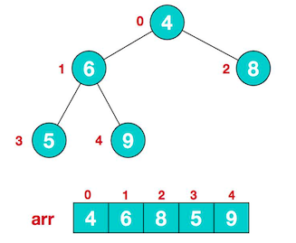
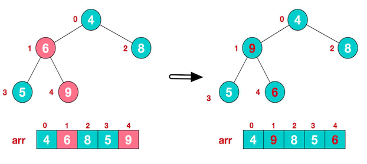

# 堆排序

## 基本介绍

堆排序是利用 **堆** 这种 **数据结构** 而设计的一种排序算法，它是一种选择排序，最坏 、最好、平均时间复杂度均为 `O(nlogn)`，它是不稳定排序。

堆是具有以下性质的完全二叉树：

- 大顶堆：每个节点的值都 **大于或等于** 其左右孩子节点的值

  注：**没有要求左右值的大小关系**

- 小顶堆：每个节点的值都 **小于或等于** 其左右孩子节点的值

举例说明：

### 大顶堆举例


对堆中的节点按层进行编号，映射到数组中如下图


大顶堆特点：`arr[i] >= arr[2*i+1] && arr[i] >= arr[2*i+2]`，i 对应第几个节点，i 从 0 开始编号

### 小顶堆举例


小顶堆特点：`arr[i] <= arr[2*i+1] && arr[i] <= arr[2*i+2]`，i 对应第几个节点，i 从 0 开始

### 排序说明

- 升序：一般采用大顶堆
- 降序：一般采用小顶堆

## 基本思想

1. 将待排序序列构造成一个大顶堆

   注意：这里使用的是数组，而不是一颗二叉树

2. 此时：整个序列的 **最大值就是堆顶的根节点**

3. 将其 **与末尾元素进行交换**，此时末尾就是最大值

4. 然后将剩余 `n-1` 个元素重新构造成一个堆，这样 就会得到 n 个元素的次小值。如此反复，便能的得到一个有序序列。

## 堆排序步骤图解

对数组 `4,6,8,5,9` 进行堆排序，将数组升序排序。

### 步骤一：构造初始堆

1. 给定无序序列结构 如下：注意这里的操作用数组，树结构只是参考理解

  

  将给定无序序列构造成一个大顶堆。 

2. **此时从最后一个非叶子节点开始调整**，从左到右，从上到下进行调整。

  叶节点不用调整，第一个非叶子节点 `arr.length/2-1 = 5/2-1 = 1 `，也就是 元素为 6 的节点。

	比较时：先让 5 与 9 比较，得到最大的那个，再和 6 比较，发现 9 大于 6，则调整他们的位置。
  
  

3. 找到第二个非叶子节点 4，由于 `[4,9,8]` 中，9 元素最大，则 4 和 9 进行交换

   

4. 此时，交换导致了子根 `[4,5,6]` 结构混乱，将其继续调整。`[4,5,6]` 中 6 最大，将 4 与 6 进行调整。

	

此时，就将一个无序序列构造成了一个大顶堆。

### 步骤二：将堆顶元素与末尾元素进行交换

将堆顶元素与末尾元素进行交换，**使其末尾元素最大**。然后继续调整，再将堆顶元素与末尾元素交换，得到第二大元素。如此反复进行交换、重建、交换。

1. 将堆顶元素 9 和末尾元素 4 进行交换

   

2. 重新调整结构，使其继续满足堆定义

   

3. 再将堆顶元素 8 与末尾元素 5 进行交换，得到第二大元素 8

   

4. 后续过程，继续进行调整、交换，如此反复进行，最终使得整个序列有序

   

### 总结思路

1. 将无序序列构建成一个堆，根据升序降序需求选择大顶堆或小顶堆
2. 将堆顶元素与末尾元素交换，将最大元素「沉」到数组末端
3. 重新调整结构，使其满足堆定义，然后继续交换堆顶与当前末尾元素，反复执行调整、交换步骤，直到整个序列有序。

## 代码实现

### 步骤推演

此推演，对照的是：堆排序步骤图解中的第一步，注意对照图解进行理解代码含义

```java
    @Test
    public void processSortTest() {
        int arr[] = {4, 6, 8, 5, 9};
        processSort(arr);
    }

    private void processSort(int[] arr) {
        // 第一次：从最后一个非叶子节点开始调整，从左到右，从上到下进行调整。
        // 参与比较的元素是：6,5,9
        int i = 1;
        int temp = arr[i]; // 6
        // 如果 i 的左比右大
        int k = i * 2 + 1; // i 的左节点

        // 要将这三个数（堆），调整为一个大顶堆
        // i 的左节点小于右节点
        if (arr[k] < arr[k + 1]) {
            k++; // 右边的大，则将 k 变成最大的那一个
        }
        // 如果左右中最大的一个数，比 i 大。则调整它
        if (arr[k] > temp) {
            arr[i] = arr[k];
            arr[k] = temp;
        }
        System.out.println(Arrays.toString(arr)); // 4,9,8,5,6

        // 第二次调整：参与比较的元素是  4,9,5
        i = 0;
        temp = arr[i]; // 4
        k = i * 2 + 1;
        if (arr[k] < arr[k + 1]) {
            k++; // 右边的大，则将 k 变成最大的那一个
        }
        // 9 比 4 大，交换的是 9 和 4
        if (arr[k] > temp) {
            arr[i] = arr[k];
            arr[k] = temp;
        }
        System.out.println(Arrays.toString(arr)); // 9，4,8,5,6

        // 上面调整导致了，第一次的堆：4,5,6 的混乱。这里要对他进行重新调整
        i = 1;
        temp = arr[i]; // 4
        k = i * 2 + 1;
        if (arr[k] < arr[k + 1]) {
            k++; // 右边的大，则将 k 变成最大的那一个
        }
        // 6 比 4 大，交换它
        if (arr[k] > temp) {
            arr[i] = arr[k];
            arr[k] = temp;
        }
        System.out.println(Arrays.toString(arr)); // 9，6,8,5,4
        // 到这里就构造成了一个大顶堆
    }
```

剩下的，是交换元素，与继续这个流程。

### 完整实现

这里想说的几点注意事项：

1. 第一步构建初始堆：**是自低向上，从左到右**。

    从上往下：每一层的大顶堆一定比它的下一层左右两节点大，也就是说，**每一层都比下一层大**。但是，左右是不要求大小的

2. 第二步让尾部元素与堆顶元素交换，**最大值被放在数组末尾**。

3. 第三步：**是从上到下，从左到右**

   因为第二步的原因，变化在堆顶，所以从堆顶开始调整；

   在初始堆的基础上，一层一层往下调整，如果哪一层没有调整过，则退出当次的调整，**因为初始堆的特点：每一层都比下一层大，可以直接退出**。

```java
 @Test
    public void sortTest() {
        int[] arr = {4, 6, 8, 5, 9};
        sort(arr);
        int[] arr2 = {99, 4, 6, 8, 5, 9, -1, -2, 100};
        sort(arr2);
    }

    private void sort(int[] arr) {
        // =====  1. 构造初始堆
        // 从第一个非叶子节点开始调整
        // 4,9,8,5,6
        //  adjustHeap(arr, arr.length / 2 - 1, arr.length);

        // 循环调整
        // 从第一个非叶子节点开始调整，自低向上
        for (int i = arr.length / 2 - 1; i >= 0; i--) {
            adjustHeap(arr, i, arr.length);
        }
        // 第一轮调整了 3 个堆后：结果为：9，6,8,5,4
        // System.out.println(Arrays.toString(arr));

        // 2. 将堆顶元素与末尾元素进行交换，然后再重新调整
        int temp = 0;
        for (int j = arr.length - 1; j > 0; j--) {
            temp = arr[j];  // j 是末尾元素
            arr[j] = arr[0];
            arr[0] = temp;
            // 这里是从第一个节点开始: 不是构建初始堆了
            // 如果
            adjustHeap(arr, 0, j);
        }
        System.out.println(Arrays.toString(arr));
    }

    /**
     * 调整堆
     *
     * @param arr
     * @param i      非叶子节点，以此节点为基础，将它、它的左、右，调整为一个大顶堆
     * @param length
     */
    private void adjustHeap(int[] arr, int i, int length) {
        // 难点是将当前的堆调整之后，影响了它后面节点堆的混乱，如何继续对影响的堆进行调整
        // 所以第一步中：是额外循环的从 低向上调整的
        //    第三步中：就是本代码的，从上到下调整的；这个很重要，一定要明白
        int temp = arr[i];
        // 从传入节点的左节点开始处理，下一次则是以该节点为顶堆的左节点进行调整
        for (int k = i * 2 + 1; k < length; k = k * 2 + 1) {
            // 要将这三个数（堆），调整为一个大顶堆
            // i 的左节点小于右节点
            // k+1 < length : 当调整长度为 2 时，也就是数组的前两个元素，其实它没有第三个节点了，就不能走这个判定
            if (k + 1 < length && arr[k] < arr[k + 1]) {
                k++; // 右边的大，则将 k 变成最大的那一个
            }
            // 如果左右中最大的一个数，比 i 大。则调整它
            if (arr[k] > temp) {
                arr[i] = arr[k];
                i = k; // i 记录被调整后的索引。
            } else {
                break;
                // 由于初始堆，就已经是大顶堆了，每个子堆的顶，都是比他的左右两个大的
                // 当这里没有进行调整的话，那么就可以直接退出了
                // 如果上面进行了调整。那么在初始堆之后，每次都是从 0 节点开始 自左到右，自上而下调整的
                //    就会一层一层的往下进行调整
            }
        }
        arr[i] = temp;
    }
```

测试信息

```
[4, 5, 6, 8, 9]
[-2, -1, 4, 5, 6, 8, 9, 99, 100]
```

