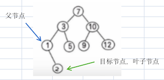
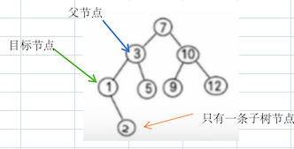
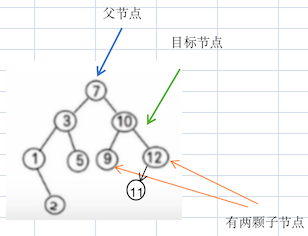

# 二叉排序树

给你一个数列 `7, 3, 10, 12, 5, 1, 9`，要求能够高效的完成对数据的查询和添加。

在 [为什么需要该数据结构](../10/01.md) 中讲解了数组、链表数据结构的优缺点，简单说：

- 数组访问快，增删慢

  新增或移除时，需要整体移动数据

- 链表增删快，访问慢

  只能从头开始遍历查找

那么利用 **二叉排序树（Binary Sort/Search Tree）**，既可以保证数据的检索速度，同时也可以保证数据的**插入**、**删除**、**修改**  的速度

## 二叉排序树介绍

 **二叉排序树（Binary Sort/Search Tree）**，简称 BST。

对于二叉排序树的任何一个 **非叶子节点**，要求如下：

- 左节点，比父节点小
- 右节点，比父节点大

特殊说明：如果有有相同的值，可以将该节点放在左节点或右节点。当然，最理想的是没有重复的值，比如 Mysql 中的 B 树索引，就是以主键 ID 来排序的。

比如对下面这个二叉树增加一个节点：


1. 从根节点开始，发现比 7 小，直接往左子树查找，相当于直接折半了
2. 比 3 小，再次折半
3. 比 1 大：直接挂在 1 的右节点

但是这里有一个疑问，如果添加元素为 4，不是应该挂在 3 的右侧吗？

## 创建与遍历

由于前面讲解了很多的二叉树知识点，添加和遍历相对简单，直接上代码

```java
package cn.mrcode.study.dsalgtutorialdemo.datastructure.binarysorttree;

import org.junit.Test;

/**
 * 二叉排序树
 */
public class BinarySortTreeTest {
    /**
     * 二叉排序树添加和遍历测试
     */
    @Test
    public void addTest() {
        BinarySortTree tree = new BinarySortTree();
        int[] arr = {7, 3, 10, 12, 5, 1, 9};
        for (int i = 0; i < arr.length; i++) {
            tree.add(new Node(arr[i]));
        }
        tree.infixOrder();
        int item = 2;
        tree.add(new Node(item));
        System.out.println("\n添加新节点：" + item + " 到二叉排序树中");
        System.out.println("添加之后的中序顺序：");
        tree.infixOrder();

        item = 4;
        tree.add(new Node(item));
        System.out.println("\n添加新节点：" + item + " 到二叉排序树中");
        System.out.println("添加之后的中序顺序：");
        tree.infixOrder();
    }
}

/**
 * 排序二叉树
 */
class BinarySortTree {
    Node root;

    /**
     * 添加节点
     *
     * @param node
     */
    public void add(Node node) {
        if (root == null) {
            root = node;
            return;
        }
        root.add(node);
    }

    /**
     * 中序遍历
     */
    public void infixOrder() {
        if (root == null) {
            return;
        }
        root.infixOrder();
    }
}

/**
 * 节点
 */
class Node {
    int value;
    Node left;
    Node right;

    public Node(int value) {
        this.value = value;
    }

    /**
     * 添加节点：按照排序二叉树的要求添加
     *
     * @param node
     */
    public void add(Node node) {
        if (node == null) {
            return;
        }
        // 如果添加的值小于当前节点，则往左走
        if (node.value < value) {
            // 左节点为空，则直接挂在上面
            if (left == null) {
                left = node;
            } else {
                // 否则继续往下查找
                left.add(node);
            }
        } else {
            // 往右走
            if (right == null) {
                right = node;
            } else {
                right.add(node);
            }
        }
    }

    /**
     * 中序遍历：刚好是从小到大的顺序
     */
    public void infixOrder() {
        if (left != null) {
            left.infixOrder();
        }
        System.out.println(value);
        if (right != null) {
            right.infixOrder();
        }
    }
}
```

输出测试

```
1
3
5
7
9
10
12

添加新节点：2 到二叉排序树中
添加之后的中序顺序：
1
2
3
5
7
9
10
12

添加新节点：4 到二叉排序树中
添加之后的中序顺序：
1
2
3
4
5
7
9
10
12
```

现在来回答这个疑问，如果添加元素为 4，不是应该挂在 3 的右侧吗？

看输出结果，没有做任何的判定，对于 中序来说就是从小到大的输出，所以这里针对的是 **某一颗子树**，是如下规则：

对于二叉排序树的任何一个 **非叶子节点**，要求如下：

- 左节点，比父节点小
- 右节点，比父节点大

**并不需要针对已经存在的节点进行调整。**

## 删除

由于节点只有 left 和 right，是单向节点，要删除一个节点：

1. 先找到这个要删除 **目标节点**

2. 找到这个目标节点的 **父节点**

   只有一种情况没有父节点，那就是目标节点就是 root 节点

找到父节点之后，我们才可以删掉目标节点，那么就有如下三类情况需要考虑：

1. 目标节点是 **叶子节点**

   

   1. 如果目标节点是 **父节点的 left 节点**，那么 left 置空
   2. 如果目标节点是 **父节点的 right 节点**，那么 rigt 置空

2. 目标节点有 **一颗子节点** left 或则 right，那么就需要将目标节点的子节点提升到目标节点位置上

   

   1. 如果目标节点是 **父节点 的 left 节点**，那么将 left 或 right 节点设置为 父节点的 left 节点
   2. 如果目标节点是 **父节点 的 right 节点**，那么将 left 或 right 节点设置为父节点的 right 节点

   简单说：因为目标节点有一颗子节点，将目标节点删除，将目标节点的子节点放到被删除的位置上。

3. 目标节点有 **两颗子节点**

   

   1. 以目标节点为根节点，**往右子树的**，**左子树**一直 **找到最小的节点**，删除它，并持有它
   2. 把 **目标节点** 从父节点的 left 或  right 中 **删掉**
      1. 删掉的位置：**替换上第 1 步中删掉的最小节点**。
      2. 将 **最小节点的 left 节点** 重置为 **目标节点的 left 节点**

   如上图所示：目标节点是 10

   ```
   1. 先往右侧为起点：12
   2. 再往左侧找，且一直往左侧找：11，这个时候  11 的左已经为空了，那么 11 就是最小节点
   3. 将 10 删掉
   4. 将 11 挂在原来 10 的位置
   5. 将 9 挂在 11 的 left 节点
   ```

以上描述注意事项：

1. 省略了需要判断目标节点是父的 left 还是 right 节点，因为涉及到你删除的时候，置空的是 父节点的 left 还是 right；这一步算是一个公共的描述步骤吧，重置的时候都需要，记得写代码的时候需要判断下。

2. 当要删除的节点是：「有两颗子节点」和「只有一颗子节点」的时候，没有考虑要删除的是否是 root 节点，如果是 root 节点，直接操作「父节点」就会空指针异常

   视频中的代码删除 root 节点，会空指针异常。笔者这里修复了这个 bug；（后面这一节有一个补充的视频，补充了这个 bug 的解决方案，写完才看到这一节）


```java
package cn.mrcode.study.dsalgtutorialdemo.datastructure.binarysorttree;

import org.junit.Test;

/**
 * 二叉排序树
 */
public class BinarySortTreeTest {

    /**
     * 删除：叶子节点
     */
    @Test
    public void delete1() {
        System.out.println("\n\n删除叶子节点：2，5，9，12");
        BinarySortTree tree = new BinarySortTree();
        int[] arr = {7, 3, 10, 12, 5, 1, 9, 2};
        for (int i = 0; i < arr.length; i++) {
            tree.add(new Node(arr[i]));
        }
        tree.infixOrder();

        // 当只实现了删除叶子节点时，这步骤是删除不成功的
//        tree.delete(1);
//        System.out.println("删除非叶子节点后的内容：");
//        tree.infixOrder();

        tree.delete(2);
        tree.delete(5);
        tree.delete(9);
        tree.delete(12);
        System.out.println("删除后的内容：");
        tree.infixOrder();
    }

    /**
     * 删除：只有一颗叶子节点的节点
     */
    @Test
    public void delete2() {
        System.out.println("\n\n只有一颗叶子节点的节点：1");
        BinarySortTree tree = new BinarySortTree();
        int[] arr = {7, 3, 10, 12, 5, 1, 9, 2};
        for (int i = 0; i < arr.length; i++) {
            tree.add(new Node(arr[i]));
        }
        tree.infixOrder();

        tree.delete(1);
        System.out.println("删除后的内容：");
        tree.infixOrder();
    }

    /**
     * 删除：有两颗子节点的 节点
     */
    @Test
    public void delete3() {
        System.out.println("\n\n有两颗子节点的节点: 10");
        BinarySortTree tree = new BinarySortTree();
        int[] arr = {7, 3, 10, 12, 5, 1, 9, 2};
        for (int i = 0; i < arr.length; i++) {
            tree.add(new Node(arr[i]));
        }
        tree.infixOrder();

        tree.delete(10);
        System.out.println("删除节点后的内容：");
        tree.infixOrder();
    }

    /**
     * 删除  root 节点
     */
    @Test
    public void deleteRoot() {
        System.out.println("\n\n删除 root 节点:7");
        BinarySortTree tree = new BinarySortTree();
        int[] arr = {7, 3, 10, 12, 5, 1, 9, 2};
        for (int i = 0; i < arr.length; i++) {
            tree.add(new Node(arr[i]));
        }
        tree.infixOrder();

        tree.delete(7);
        System.out.println("删除节点后的内容：");
        tree.infixOrder();
    }

    /**
     * 排序二叉树
     */
    class BinarySortTree {
        Node root;

        /**
         * 添加节点
         *
         * @param node
         */
        public void add(Node node) {
            if (root == null) {
                root = node;
                return;
            }
            root.add(node);
        }

        /**
         * 中序遍历
         */
        public void infixOrder() {
            if (root == null) {
                return;
            }
            root.infixOrder();
        }

        /**
         * 查找目标节点
         *
         * @param value
         * @return
         */
        public Node searchTarget(int value) {
            if (root == null) {
                return null;
            }
            return root.searchTarget(value);
        }

        /**
         * 查找父节点
         *
         * @param value
         * @return
         */
        public Node searchParent(int value) {
            if (root == null) {
                return null;
            }
            if (root.value == value) {
                return null;
            }
            return root.searchParent(value);
        }


        /**
         * 删除节点
         * <pre>
         *   注意：删除节点的思路是找到 目标节点 和 父节点，利用这两个节点就可以完成删除了，
         *        而不是去递归查找的。这一点需要明白，而且很重要。否则你将不知道递归如何写
         * </pre>
         *
         * @param value
         */
        public void delete(int value) {
            if (root == null) {
                return;
            }
            Node target = searchTarget(value);
            // 如果没有找到目标节点，则返回
            if (target == null) {
                return;
            }
            // 如果找到了节点
            // 并且，root 没有子节点了，则说明当前只有 root 一个节点
            if (root.left == null && root.right == null) {
                root = null;
                return;
            }

            Node parent = searchParent(value);


            // 1. 如果目标节点是叶子节点
            if (target.left == null && target.right == null) {
                // 如果目标节点是 父节点的 左节点
                if (parent.left != null && target.value == parent.left.value) {
                    parent.left = null;
                    return;
                }
                // 如果目标节点是 父节点的 右节点
                if (parent.right != null && target.value == parent.right.value) {
                    parent.right = null;
                    return;
                }
            }
            // 2. 如果目标节点有两颗子节点
            else if (target.left != null && target.right != null) {
                // 以目标节点为 root 节点，找到左子树中最小的节点，并删掉；也就是找到左子树中的一个 叶子节点
                Node min = deleteRightTreeMin(target);

                // 如果删除的是 root 节点，全程不要操作 parent
                if (parent == null) {
                    root = min;
                    min.right = target.right;
                    min.left = target.left;
                    return;
                }

                // 如果是父节点的 左节点
                if (parent.left != null && target.value == parent.left.value) {
                    parent.left = min;
                    min.right = target.right;
                    min.left = target.left;
                    return;
                }
                // 如果是父节点的 右节点
                if (parent.right != null && target.value == parent.right.value) {
                    parent.right = min;
                    min.right = target.right;
                    min.left = target.left;
                    return;
                }
            }
            // 3. 如果目标节点有 1 颗子节点
            else {
                // 如果删除的是 root 节点，全程不要操作 parent
                // 由于目标节点有一颗节点，先拿到这个要替换掉目标节点的  节点
                Node replaceNode = null;
                // 要替换的节点，由于只有一个，不是左就是右
                if (target.left != null) {
                    replaceNode = target.left;
                } else {
                    replaceNode = target.right;
                }
                // 如果要删除的是 root 节点
                if (parent == null) {
                    root = replaceNode;
                    return;
                }

                // 如果是父节点的 左节点
                if (parent.left != null && target.value == parent.left.value) {
                    parent.left = replaceNode;
                    return;
                }
                if (parent.right != null && target.value == parent.right.value) {
                    parent.right = replaceNode;
                }
            }
            return;
        }

        /**
         * 以目标节点为 root 节点，找到左子树中最小的节点，并删掉；也就是找到左子树中的一个 叶子节点
         *
         * @param target
         * @return
         */
        private Node deleteRightTreeMin(Node target) {
            Node min = target.right;
            while (min.left != null) {
                min = min.left;
            }
            delete(min.value);
            return min;
        }
    }
}

/**
 * 节点
 */
class Node {
    int value;
    Node left;
    Node right;

    public Node(int value) {
        this.value = value;
    }

    /**
     * 搜索目标节点
     *
     * @param value
     * @return
     */
    public Node searchTarget(int value) {
        if (value == this.value) {
            return this;
        } else if (value < this.value) {
            if (left != null) {
                return left.searchTarget(value);
            }
        } else {
            if (right != null) {
                return right.searchTarget(value);
            }
        }
        return null;
    }

    /**
     * 查找目标值的父节点
     *
     * @param value
     * @return
     */
    public Node searchParent(int value) {
        // 本节点能匹配到左右两节点其中一个等于，则父节点是本节点
        if (left != null && left.value == value
                || right != null && right.value == value
        ) {
            return this;
        }
        if (value < this.value && left != null) {
            return left.searchParent(value);
        }
        if (value >= this.value && right != null) {
            return right.searchParent(value);
        }
        return null;
    }

    @Override
    public String toString() {
        return "Node{" +
                "value=" + value +
                '}';
    }
}
```

测试输出

```
删除叶子节点：2，5，9，12
1
2
3
5
7
9
10
12
删除后的内容：
1
3
7
10
```

```
只有一颗叶子节点的节点：1
1
2
3
5
7
9
10
12
删除后的内容：
2
3
5
7
9
10
12
```

```
有两颗子节点的节点: 10
1
2
3
5
7
9
10
12
删除节点后的内容：
1
2
3
5
7
9
12
```

```
删除 root 节点:7
1
2
3
5
7
9
10
12
删除节点后的内容：
1
2
3
5
9
10
12
```


## 完整代码

```java
package cn.mrcode.study.dsalgtutorialdemo.datastructure.binarysorttree;

import org.junit.Test;

/**
 * 二叉排序树
 */
public class BinarySortTreeTest {
    /**
     * 二叉排序树添加和遍历测试
     */
    @Test
    public void addTest() {
        BinarySortTree tree = new BinarySortTree();
        int[] arr = {7, 3, 10, 12, 5, 1, 9};
        for (int i = 0; i < arr.length; i++) {
            tree.add(new Node(arr[i]));
        }
        tree.infixOrder();
        int item = 2;
        tree.add(new Node(item));
        System.out.println("\n添加新节点：" + item + " 到二叉排序树中");
        System.out.println("添加之后的中序顺序：");
        tree.infixOrder();

        item = 4;
        tree.add(new Node(item));
        System.out.println("\n添加新节点：" + item + " 到二叉排序树中");
        System.out.println("添加之后的中序顺序：");
        tree.infixOrder();
    }

    /**
     * 删除：叶子节点
     */
    @Test
    public void delete1() {
        System.out.println("\n\n删除叶子节点：2，5，9，12");
        BinarySortTree tree = new BinarySortTree();
        int[] arr = {7, 3, 10, 12, 5, 1, 9, 2};
        for (int i = 0; i < arr.length; i++) {
            tree.add(new Node(arr[i]));
        }
        tree.infixOrder();

        // 当只实现了删除叶子节点时，这步骤是删除不成功的
//        tree.delete(1);
//        System.out.println("删除非叶子节点后的内容：");
//        tree.infixOrder();

        tree.delete(2);
        tree.delete(5);
        tree.delete(9);
        tree.delete(12);
        System.out.println("删除后的内容：");
        tree.infixOrder();
    }

    /**
     * 删除：只有一颗叶子节点的节点
     */
    @Test
    public void delete2() {
        System.out.println("\n\n只有一颗叶子节点的节点：1");
        BinarySortTree tree = new BinarySortTree();
        int[] arr = {7, 3, 10, 12, 5, 1, 9, 2};
        for (int i = 0; i < arr.length; i++) {
            tree.add(new Node(arr[i]));
        }
        tree.infixOrder();

        tree.delete(1);
        System.out.println("删除后的内容：");
        tree.infixOrder();
    }

    /**
     * 删除：有两颗子节点的 节点
     */
    @Test
    public void delete3() {
        System.out.println("\n\n有两颗子节点的节点: 10");
        BinarySortTree tree = new BinarySortTree();
        int[] arr = {7, 3, 10, 12, 5, 1, 9, 2};
        for (int i = 0; i < arr.length; i++) {
            tree.add(new Node(arr[i]));
        }
        tree.infixOrder();

        tree.delete(10);
        System.out.println("删除节点后的内容：");
        tree.infixOrder();
    }

    /**
     * 删除  root 节点
     */
    @Test
    public void deleteRoot() {
        System.out.println("\n\n删除 root 节点:7");
        BinarySortTree tree = new BinarySortTree();
        int[] arr = {7, 3, 10, 12, 5, 1, 9, 2};
        for (int i = 0; i < arr.length; i++) {
            tree.add(new Node(arr[i]));
        }
        tree.infixOrder();

        tree.delete(7);
        System.out.println("删除节点后的内容：");
        tree.infixOrder();
    }

    /**
     * 排序二叉树
     */
    class BinarySortTree {
        Node root;

        /**
         * 添加节点
         *
         * @param node
         */
        public void add(Node node) {
            if (root == null) {
                root = node;
                return;
            }
            root.add(node);
        }

        /**
         * 中序遍历
         */
        public void infixOrder() {
            if (root == null) {
                return;
            }
            root.infixOrder();
        }

        /**
         * 查找目标节点
         *
         * @param value
         * @return
         */
        public Node searchTarget(int value) {
            if (root == null) {
                return null;
            }
            return root.searchTarget(value);
        }

        /**
         * 查找父节点
         *
         * @param value
         * @return
         */
        public Node searchParent(int value) {
            if (root == null) {
                return null;
            }
            if (root.value == value) {
                return null;
            }
            return root.searchParent(value);
        }


        /**
         * 删除节点
         * <pre>
         *   注意：删除节点的思路是找到 目标节点 和 父节点，利用这两个节点就可以完成删除了，
         *        而不是去递归查找的。这一点需要明白，而且很重要。否则你将不知道递归如何写
         * </pre>
         *
         * @param value
         */
        public void delete(int value) {
            if (root == null) {
                return;
            }
            Node target = searchTarget(value);
            // 如果没有找到目标节点，则返回
            if (target == null) {
                return;
            }
            // 如果找到了节点
            // 并且，root 没有子节点了，则说明当前只有 root 一个节点
            if (root.left == null && root.right == null) {
                root = null;
                return;
            }

            Node parent = searchParent(value);


            // 1. 如果目标节点是叶子节点
            if (target.left == null && target.right == null) {
                // 如果目标节点是 父节点的 左节点
                if (parent.left != null && target.value == parent.left.value) {
                    parent.left = null;
                    return;
                }
                // 如果目标节点是 父节点的 右节点
                if (parent.right != null && target.value == parent.right.value) {
                    parent.right = null;
                    return;
                }
            }
            // 2. 如果目标节点有两颗子节点
            else if (target.left != null && target.right != null) {
                // 以目标节点为 root 节点，找到左子树中最小的节点，并删掉；也就是找到左子树中的一个 叶子节点
                Node min = deleteRightTreeMin(target);

                // 如果删除的是 root 节点，全程不要操作 parent
                if (parent == null) {
                    root = min;
                    min.right = target.right;
                    min.left = target.left;
                    return;
                }

                // 如果是父节点的 左节点
                if (parent.left != null && target.value == parent.left.value) {
                    parent.left = min;
                    min.right = target.right;
                    min.left = target.left;
                    return;
                }
                // 如果是父节点的 右节点
                if (parent.right != null && target.value == parent.right.value) {
                    parent.right = min;
                    min.right = target.right;
                    min.left = target.left;
                    return;
                }
            }
            // 3. 如果目标节点有 1 颗子节点
            else {
                // 如果删除的是 root 节点，全程不要操作 parent

                // 因为只有一颗节点，不是左就是右边
               /* if (target.left != null) {
                    // 删除的如果是 root 节点
                    if (parent == null) {
                        root = target.left;
                        return;
                    }
                    // 如果是父节点的 左节点
                    if (parent.left != null && target.value == parent.left.value) {
                        parent.left = target.left;
                        return;
                    }
                    if (parent.right != null && target.value == parent.right.value) {
                        parent.right = target.left;
                    }
                } else {
                    // 删除的如果是 root 节点
                    if (parent == null) {
                        root = target.right;
                        return;
                    }
                    // 如果是父节点的 右节点
                    if (parent.left != null && target.value == parent.left.value) {
                        parent.left = target.right;
                        return;
                    }
                    if (parent.right != null && target.value == parent.right.value) {
                        parent.right = target.right;
                    }
                }
                */
                // 上面的写法重构后为下面这样
                // 由于目标节点有一颗节点，先拿到这个要替换掉目标节点的  节点
                Node replaceNode = null;
                // 要替换的节点，由于只有一个，不是左就是右
                if (target.left != null) {
                    replaceNode = target.left;
                } else {
                    replaceNode = target.right;
                }
                // 如果要删除的是 root 节点
                if (parent == null) {
                    root = replaceNode;
                    return;
                }

                // 如果是父节点的 左节点
                if (parent.left != null && target.value == parent.left.value) {
                    parent.left = replaceNode;
                    return;
                }
                if (parent.right != null && target.value == parent.right.value) {
                    parent.right = replaceNode;
                }
            }
            return;
        }

        /**
         * 以目标节点为 root 节点，找到左子树中最小的节点，并删掉；也就是找到左子树中的一个 叶子节点
         *
         * @param target
         * @return
         */
        private Node deleteRightTreeMin(Node target) {
            Node min = target.right;
            while (min.left != null) {
                min = min.left;
            }
            delete(min.value);
            return min;
        }
    }
}

/**
 * 节点
 */
class Node {
    int value;
    Node left;
    Node right;

    public Node(int value) {
        this.value = value;
    }

    /**
     * 添加节点：按照排序二叉树的要求添加
     *
     * @param node
     */
    public void add(Node node) {
        if (node == null) {
            return;
        }
        // 如果添加的值小于当前节点，则往左走
        if (node.value < value) {
            // 左节点为空，则直接挂在上面
            if (left == null) {
                left = node;
            } else {
                // 否则继续往下查找
                left.add(node);
            }
        } else {
            // 往右走
            if (right == null) {
                right = node;
            } else {
                right.add(node);
            }
        }
    }

    /**
     * 中序遍历：刚好是从小到大的顺序
     */
    public void infixOrder() {
        if (left != null) {
            left.infixOrder();
        }
        System.out.println(value);
        if (right != null) {
            right.infixOrder();
        }
    }


    /**
     * 搜索目标节点
     *
     * @param value
     * @return
     */
    public Node searchTarget(int value) {
        if (value == this.value) {
            return this;
        } else if (value < this.value) {
            if (left != null) {
                return left.searchTarget(value);
            }
        } else {
            if (right != null) {
                return right.searchTarget(value);
            }
        }
        return null;
    }

    /**
     * 查找目标值的父节点
     *
     * @param value
     * @return
     */
    public Node searchParent(int value) {
        // 本节点能匹配到左右两节点其中一个等于，则父节点是本节点
        if (left != null && left.value == value
                || right != null && right.value == value
        ) {
            return this;
        }
        if (value < this.value && left != null) {
            return left.searchParent(value);
        }
        if (value >= this.value && right != null) {
            return right.searchParent(value);
        }
        return null;
    }

    @Override
    public String toString() {
        return "Node{" +
                "value=" + value +
                '}';
    }
}
```


