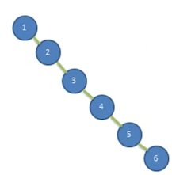
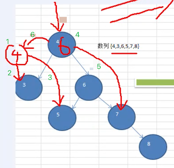
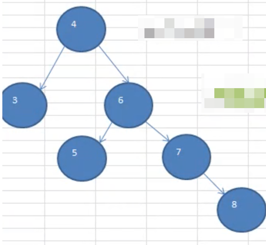
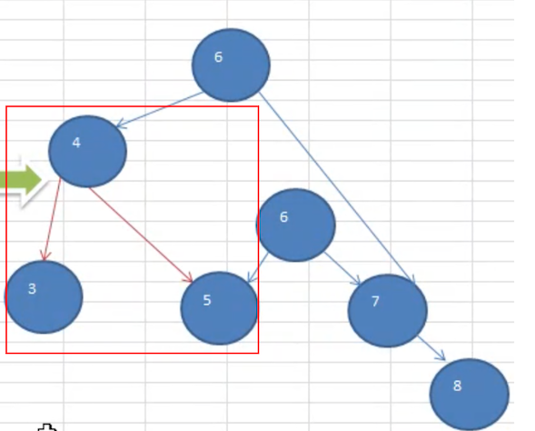

# 完整平衡二叉树（AVL树）

## 二叉排序树可能的问题

一个数列 `{1,2,3,4,5,6}`，创建一颗二叉排序树（BST）



创建完成的树如上图所示，那么它存在的问题有以下几点：

1. 左子树全部为空，从形式上看，更像一个单链表

2. 插入速度没有影响

3. 查询速度明显降低

   因为需要依次比较，不能利用二叉排序树的折半优势。而且每次都还要比较左子树，可能比单链表查询速度还慢。

那么解决这个劣势的方案就是：**平衡二叉树（AVL）**。

## 基本介绍

平衡二叉树也叫 **平衡二叉搜索树（Self-balancing binary search tree）**，又被称为 AVL 树，可以保证 **查询效率较高**。它是解决 **二叉排序** 可能出现的查询问题。

它的特点：是一颗空树或它的 **左右两个子树的高度差的绝对值不超过 1**，并且左右两个子树都是一颗平衡二叉树。

平衡二叉树的常用实现方法有：

- 红黑树
- AVL（算法）
- 替罪羊树
- Treap
- 伸展树

如下所述，哪些是平衡二叉树？


1. 是平衡二叉树：

   - 左子树高度为 2
   - 右子树高度为 1

   他们差值为 1

2. 也是平衡二叉树

3. 不是平衡二叉树

   1. 左子树高度为 3
   2. 右子树高度为 1

   他们差值为 2，所以不是

## 单旋转（左旋转）

一个数列 `4,3,6,5,7,8` ，创建出它对应的平衡二叉树。

思路分析：下图红线部分是调整流程。



按照规则调整完成之后，形成了下面这样一棵树


完整流程如下图所示：


插入 8 时，发现左右子树高度相差大于 1，则进行左旋转：

1. 创建一个新的节点 `newNode`，值等于当前 **根节点** 的值（以 4 创建）

2. 把新节点的 **左子树** 设置为当前节点的 **左子树**

   ```java
   newNode.left = left
   ```

3. 把新节点的 **右子树** 设置为当前节点的 **右子树的左子树**

   ```java
   newNode.right = right.left
   ```

4. 把 **当前节点** 的值换为 **右子节点** 的值

   ```java
   value = right.value
   ```
   
5. 把 **当前节点** 的右子树设置为 **右子树的右子树**

   ```jaava
   right = right.right
   ```

6. 把 **当前节点** 的左子树设置为新节点

   ```java
   left = newNode
   ```

注：左图是调整期，右图是调整后。注意调整期的 6 那个节点，**调整之后，没有节点指向他了**。也就是说，遍历的时候它是不可达的。那么将会自动的被垃圾回收掉。

### 树高度计算

前面说过，平衡二叉树是为了解决二叉排序树中可能出现的查找效率问题，那么基本上的代码都可以在之前的二叉排序树上进行优化。那么下面只给出与当前主题相关的代码，最后放出一份完整的代码。

树的高度计算，我们需要得到 3 个高度：

1.  这颗树的整体高度
2. 左子树的高度
3. 右子树的高度

```java
public class AvlTreeTest {
    /**
     * 树高度测试
     */
    @Test
    public void heightTest() {
        AvlTree tree = new AvlTree();
        int[] arr = {4, 3, 6, 5, 7, 8};
        for (int i = 0; i < arr.length; i++) {
            tree.add(new Node(arr[i]));
        }
        tree.infixOrder();
        System.out.println("树高度：" + tree.root.height());   // 4
        System.out.println("左树高度：" + tree.root.leftHeight());  // 1
        System.out.println("右树高度：" + tree.root.rightHeight()); // 3
    }
}

/**
 * 排序二叉树
 */
class AvlTree {
    Node root;

    public Node getRoot() {
        return root;
    }
}

/**
 * 节点
 */
class Node {
   /**
     * 以当前节点为基础：计算出它包含它子树的所有高度
     *
     * @return
     */
    public int height() {
        /*
          这里使用了递归：返回了左右子树中，最高的那一个数值。
          递归原理：第一个开始统计的时候，一定是一个叶子节点
                  根据这个逻辑：叶子节点的 Math.max(0,0) = 0
                  因为当前节点算一层，所以 + 1;

                  返回到上一层的时候，至少是这样：Math.max(1,0) = 1
                  然后把自己本身的层 +1。 以此类推，返回到根节点的时候，就拿到了从包含根节点的树的高度
         */
        return Math.max(
                (left == null ? 0 : left.height()),
                (right == null ? 0 : right.height())
        ) + 1;
    }

    /**
     * 计算左子树的高度
     *
     * @return
     */
    public int leftHeight() {
        if (left == null) {
            return 0;
        }
        // 如果从根节点开始的话
        // 其实它从中间分开，左侧就有很多的小树
        // 所以还是要计算左右树的高度，返回一个最大的值，只不过是开始节点变化了
        return left.height();
    }

    /**
     * 计算右子树的高度
     *
     * @return
     */
    public int rightHeight() {
        if (right == null) {
            return 0;
        }
        return right.height();
    }
}
```

测试输出

```
3
4
5
6
7
8
树高度：4
左树高度：1
右树高度：3
```

### 旋转

说下旋转的时机：也就是什么时机采取做旋转的操作？

当然是：`当 右子树高度 - 左子树高度 > 1 ` 时，才执行左旋转。

这里就得到一些信息:

1. 每次添加完一个节点后，就需要检查树的高度

2. 满足 `右子树高度 - 左子树高度 > 1 `，那么一定满足下面的条件：

   1. 左子树高度为 1
   2. 右子树高度为 2

   也就是符合这张图

   

也正是有如上的信息逻辑，在实现旋转的时候，只要按照思路分析写就可以了，不需要进行边界判定了。

```java
class Node {
      /**
     * 添加节点：按照排序二叉树的要求添加
     *
     * @param node
     */
    public void add(Node node) {
        if (node == null) {
            return;
        }
        // 如果添加的值小于当前节点，则往左走
        if (node.value < value) {
            // 左节点为空，则直接挂在上面
            if (left == null) {
                left = node;
            } else {
                // 否则继续往下查找
                left.add(node);
            }
        } else {
            // 往右走
            if (right == null) {
                right = node;
            } else {
                right.add(node);
            }
        }

        // 旋转的时候有以下规则
        // 每添加一个节点之后：检查树的高度是否平衡
        //      如果右子树高度 - 左子树高度 > 1，则左旋转
        //      也就是说：每次旋转的层只涉及到 4 层(对照笔记上的图示理解)
        if (rightHeight() - leftHeight() > 1) {
            leftRotate();
        }
    }

    /**
     * 以当前节点为根节点，进行左旋转
     */
    public void leftRotate() {
        // 1. 创建一个新的节点 newNode，值等于当前 根节点 的值
        Node newNode = new Node(value);
        // 2. 把 新节点的 左子树 设置为当前节点的左子树
        newNode.left = left;
        // 3. 把 新节点的 右子树 设置为当前节点的 右子树的左子树
        newNode.right = right.left;
        // 4. 把 当前节点的值，替换为 右子树 节点的子
        value = right.value;
        // 5. 把 当前节点 的 右节点 设置为 右子树的右子树
        right = right.right;
        // 6. 把 当前节点 的 左节点 设置为 新节点
        left = newNode;
    }
}


```

测试

```java
    /**
     * 左旋转测试
     */
    @Test
    public void leftRotatedTest() {
        AvlTree tree = new AvlTree();
        int[] arr = {4, 3, 6, 5, 7, 8};
        for (int i = 0; i < arr.length; i++) {
            tree.add(new Node(arr[i]));
        }
        tree.infixOrder();
        System.out.println("树高度：" + tree.root.height());   // 3
        System.out.println("左树高度：" + tree.root.leftHeight());  // 2
        System.out.println("右树高度：" + tree.root.rightHeight()); // 2
    }
```

测试输出

```
3
4
5
6
7
8
树高度：3
左树高度：2
右树高度：2
```


看完代码之后，它的旋转其实就是，将 root 节点，往下沉到了，root.right 节点下面。



看着上图，是否有想过，貌似根本就可以不用前面讲解的 6 个步骤来旋转：

1. 不用创建新节点
2. 直接将 node 节点下沉
3. 更改 node 的 right 节点为 right.left
4. 更改 right.left = node

其实就已经完成了旋转。但是你仔细想一想，旋转逻辑是写在 node 里面的， avgTree 中的引用如何改变？除非把旋转逻辑移动到 avgTree 中去，就可以省略掉新建节点的步骤来完成。

## 右旋转

 其实这个就很好理解了：

- 左旋转：`右 - 左 > 1`，把右边的往左边旋转一层
- 右旋转：`左 - 右 > 1`，把左边的往右边旋转一层

他们其实是反着来的，那么右旋转的思路如下：

1. 创建一个新的节点 `newNode`，值等于当前 **根节点** 的值（以 4 创建）

2. 把新节点的 **右子树** 设置为当前节点的 **右子树**

   ```java
   newNode.right = right
   ```

3. 把新节点的 **左子树** 设置为当前节点的 **左子树的右子树**

   ```java
   newNode.left = left.right
   ```

4. 把 **当前节点** 的值换为 **左子节点** 的值

   ```java
   value = left.value
   ```
   
5. 把 **当前节点** 的左子树设置为 **左子树的左子树**

   ```jaava
   left = left.left
   ```

6. 把 **当前节点** 的右子树设置为新节点

   ```java
   right = newNode
   ```

上述步骤就是对下图的描述：查看图示更清楚

   

```java
class Node {
  /**
     * 添加节点：按照排序二叉树的要求添加
     *
     * @param node
     */
    public void add(Node node) {
        if (node == null) {
            return;
        }
        // 如果添加的值小于当前节点，则往左走
        if (node.value < value) {
            // 左节点为空，则直接挂在上面
            if (left == null) {
                left = node;
            } else {
                // 否则继续往下查找
                left.add(node);
            }
        } else {
            // 往右走
            if (right == null) {
                right = node;
            } else {
                right.add(node);
            }
        }

        // 旋转的时候有以下规则
        // 每添加一个节点之后：检查树的高度是否平衡
        //      如果右子树高度 - 左子树高度 > 1，则左旋转
        //      也就是说：每次旋转的层只涉及到 4 层(对照笔记上的图示理解)
        if (rightHeight() - leftHeight() > 1) {
            leftRotate();
        }

        if (leftHeight() - rightHeight() > 1) {
            rightRotate();
        }
    }
      /**
     * 以当前节点为根节点，进行右旋转
     */
    public void rightRotate() {
        // 1. 创建一个新的节点 newNode，值等于当前 根节点 的值
        Node newNode = new Node(value);
        // 2. 把 新节点的 右子树 设置为当前节点的右子树
        newNode.right = right;
        // 3. 把 新节点的 左子树 设置为当前节点的 左子树的右子树
        newNode.left = left.right;
        // 4. 把 当前节点的值，替换为 左子树 节点的子
        value = left.value;
        // 5. 把 当前节点 的 左节点 设置为 左子树的左子树
        left = left.left;
        // 6. 把 当前节点 的 右节点 设置为 新节点
        right = newNode;
    }
}
```

测试

```java
    /**
     * 右旋转测试
     */
    @Test
    public void rightRotatedTest() {
        AvlTree tree = new AvlTree();
        int[] arr = {10, 12, 8, 9, 7, 6};
        for (int i = 0; i < arr.length; i++) {
            tree.add(new Node(arr[i]));
        }
        tree.infixOrder();
        System.out.println("树高度：" + tree.root.height());   // 3
        System.out.println("左树高度：" + tree.root.leftHeight());  // 2
        System.out.println("右树高度：" + tree.root.rightHeight()); // 2
        System.out.println("当前根节点：" + tree.root); // 8
    }
```

测试输出

```
6
7
8
9
10
12
树高度：3
左树高度：2
右树高度：2
当前根节点：Node{value=8}
```

