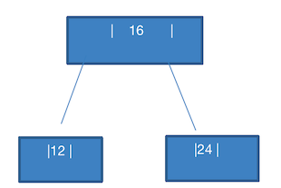
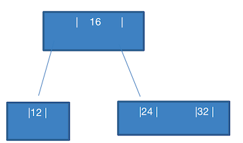
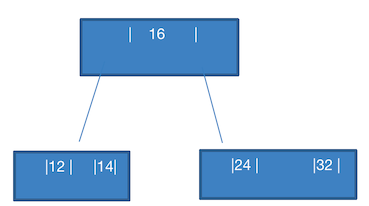
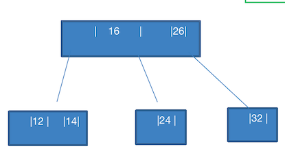
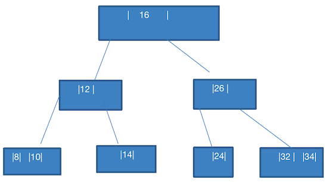
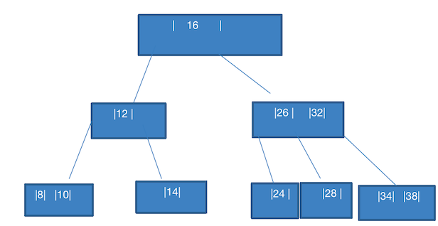
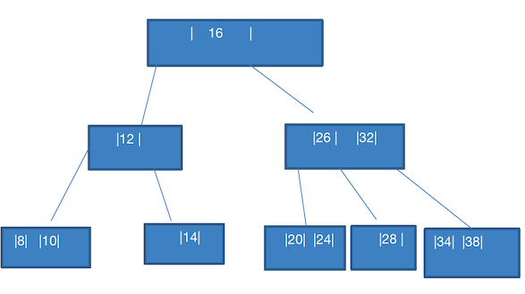

# 二叉树与 B 树

## 二叉树存在的问题

二叉树的操作效率较高，但是也存在问题，如下图所示

当二叉树的节点较少时，不会出现什么问题。但是当节点过多时（海量，如 1 亿），就会出现如下的问题：

1. 构建二叉树时，需要进行多次 I/O 操作

   节点较多时，一般会存储在文件或则数据库中，进行多次 I/O 获取到所有的节点，速度有影响

2. 会造成二叉树的高度很大，降低操作速度

## 多叉树

为了解决层数过多的问题，就出现了 **多叉树**。

在二叉树中，每个节点有数据项，最多有两个子节点。如果允许每个节点可以有更多的数据项和更多的子节点，就是 **多叉树（multiway tree）**。

多叉树也有一定的规则的，比如后面讲解的 2-3 树、2-3-4 树，就是多叉树。

**多叉树通过重新组织节点，减少树的高度，对二叉树进行优化。**

下图则是一颗 2-3 的多叉树：

2-3 的原因：如上图按节点数量来定义的。有的只有 2 个子节点，有的有 3 个子节点。

## B 树的基本介绍

B 树通过重新组织节点，降低树的高度，并且减少 I/O 读写次数来提升效率。

上图说明：

- 一个圆圈表示一个数据项
- 相连的数据项，整个表示一个节点

那么它的有点如何理解呢？

- 降低树的高度：

  可以看到，一个节点中有很多数据项，就能大大减少节点数量，从而降低树的高度

- 减少 I/O 读写次数

  文件系统及数据库系统的设计者利用了 **磁盘预读原理**，**将一个节点的大小设为等于一个页（通常大小为 4K）**，这样每个节点只需要一次 I/O 就可以完全载入。

  这样说，你可能没有概念，举个例子：将树的度 M 设置为 1024 ，在 600 亿个元素中最多只需要 4 次 I/O 操作就可以读取到想要的元素。

  B 树（B+ ）广泛应用于文件存储系统以及数据库系统中。

  什么是 **度**？

  - 节点的度：一个节点下的子树节点个数就是 节点的度。
  - 树的度：指一颗树中，节点的度最大的哪一个值。

B 树其实就是前面所说的 **多叉树**

## 2-3 树

2-3 树是最简单的 B 树结构，具有如下特点：

1. 所有 **叶子节点** 都在同一层

   只要是 B 树都满足这个条件，就是满树。

2. 有两个子节点的节点叫 **二节点**

   二节点要么 **没有子节点**，要么 **必须有两个子节点**。

3. 有三个子节点的节点叫 **三节点**

   三节点要么 **没有子节点**，要么 **必须有三个子节点**。

4. 2-3 树是由 **二节点** 和 **三节点** 构成的树

### 2-3 树构建图解

对数列 `{16, 24, 12, 32, 14, 26, 34, 10, 8, 28, 38, 20} ` 构建成一个 2-3 树，那么它构建的规则要满足前面说的特点。下面进行图解后，你就明白，上面的特点是如何限制的。

有几个额外的注意事项：

1. **一个节点中，最多只允许放 2 个数据**。
2. 构建的树必须是有序的，也就是按照二叉排序（BST）的要求构建有序的树

下面是图解步骤：

1. 添加 16、24

   

   添加 16 时，没有数据，直接新建一个节点，放进去。

   添加 24 时，发现有一个节点了，并且比 16 大，此时该节点中只有一个数据，则将 24 放在 16 的右边。

2. 添加 12

   

   此时会发现，12 比 16 小，本来应该放在 16 的左边，此时发现这个节点 **已经有两个数据了**，那么就只能放在 **左子节点** 。

   如果直接将 12 放到 `16,24` 的左节点，就会破坏 2-3 树的条件：**2 节点，要么没有子节点，要么有两个**。

   那么此时就只能将 `16,24` 这个节点进行拆分。如上图：24 变成 16 的右节点，12 变成 16 的左节点。这时就满足了 2-3 的特性。

3. 添加 32 

   这个就简单了，以现在的树结构，可以直接添加到  24 的 右边，变成 `24,32`

   

4. 添加 14

   这个也简单，直接添加到 12 的右边，变成 `12,14`

   

5. 添加 26

   此时应该添加到 `24,32` 的中间，由于一个节点只能添加两个数据，那么就需要拆分。

   

   为了满足 B 树特点，发现上层的 `16` 只有一个数，那么就补足它。组成 `16,26`。

   因为此时 `24,32` **这个节点，不满足 BST 的排序了**，24 是小于 26 的。只有 32 满足。

   **拆完上层，再拆本层**：由于 24 介于 `16,26` 之间，**则将它安排在 3 节点中的中间节点**，`24,32` 把 24 拆分出去了，只剩下 `32`，此时完全满足 B 树的特点。

6. 添加 34

   此时就简单了，添加到  `32,34` 中

   

7. 添加 10

   此时应该添加到 `12,14` 的左侧。但是不满足条件：一个节点最多只能装 2 个数据。

   放到 `12,14` 的左节点，也不满足条件：所有叶子节点必须在同一层、也不满足 2-3 节点的数量要求。

   那么此时就需要拆分，先看他的上层 `16,26` 是满的，如何做呢？看下图：

   

   左侧的拆分图，上面我们分析过了，不满足 B 树要求。那么就需要拆分成右图这样：
   
   1.  将 `12,14` 中的 14 拆分成 右子节点，10 挂在 左节点。
   2. 此时不满足 B 树要求的，则将 `16,26` 中的 26 拆分成 右子节点。
   3. `24` 这个节点由于上层被拆分了，不满足在中间节点了。调整它的位置
   4. 原来的 `32,34` 节点调整为  `16` 的右节点。
   
8. 添加 8

   此时很简单，组成 `8,10` 即可

   

9. 添加 28

   

   这里笔者有点小小的疑问，此时  28 不是应该加在 `26,28` 吗？难道说这里还有一个规则：

   - **只有一个数据的节点**，下面只允许 **最多有 2 个节点，要么没有**
   - **有 2 个数据的节点**，下面只允许 **最多有 3 个节点，要么没有**

10. 添加 38 

   此时就简单，直接组成 `34,38`

   

11. 添加 20

    这个也简单，直接组成 `20,24`

    

### 2-3 树添加规则总结

满足如下特点：

1. 所有 **叶子节点** 都在同一层

   只要是 B 树都满足这个条件，就是满树。

2. 有两个子节点的节点叫 **二节点**

   二节点要么 **没有子节点**，要么 **必须有两个子节点**。

3. 有三个子节点的节点叫 **三节点**

   三节点要么 **没有子节点**，要么 **必须有三个子节点**。

4. 2-3 树是由 **二节点** 和 **三节点** 构成的树

5. 构建的树，要满足二叉排序树（BST） 的顺序

6. **一个节点中，最多只允许放 2 个数据**。

7. **只有一个数据的节点**，下面只允许 **最多有 2 个节点，要么没有**

8. **有 2 个数据的节点**，下面只允许 **最多有 3 个节点，要么没有**

