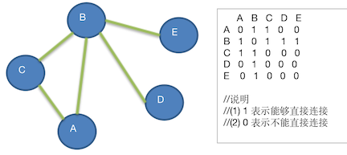

# 广度优先算法的代码实现

记住这个步骤：

1. 访问初始节点 v ，并标记节点 v 为已访问
2. 节点 v 入队列
3. 当队列非空时，继续执行，否则算法结束（仅对 v 的节点算法结束）。
4. 出队列，取得队头的节点 u
5. 查找节点 u 的第一个邻接节点 w
6. 若节点 u 的邻接节点 w 不存在，则跳转到步骤 3；否则执行以下三个步骤：
   1. 若节点 w 尚未被访问，则访问节点 w 并标记为已访问
   2. 节点 w 入队列
   3. 查找节点 u 的继 w 邻接节点后的下一个邻接节点 w，转到步骤 6

下面的代码实现也是这个步骤来实现的

```java
        /**
         * 对整个节点进行 广度优先 遍历
         */
        public void bsf() {
            for (int i = 0; i < vertexs.size(); i++) {
                // 如果已经访问过，则跳过
                if (isVisiteds[i]) {
                    continue;
                }
                // 没有访问过，则以此节点为基础进行深度遍历
                bsf(i);
                // System.out.println("");  // 换行 1
            }
        }

        /**
         * 对单个节点为初始节点，进行广度优先遍历
         *
         * @param i
         */
        private void bsf(int i) {
            // 访问该节点，并标记已经访问
            System.out.print(getValueByIndex(i) + " → ");
            isVisiteds[i] = true;

            // 将访问过的添加到队列中
            LinkedList<Integer> queue = new LinkedList<>();
            queue.addLast(i); // 添加到末尾

            int u; // 队列头的节点
            int w; // u 的下一个邻接节点
            // 当队列不为空的时候，查找节点 u 的第一个邻接节点 w
            while (!queue.isEmpty()) {
               // System.out.println("");  // 换行 2
                u = queue.removeFirst();
                w = getFirstNeighbor(u);
                // w 存在的话
//                while (w != -1) {
//                    // 如果 w 已经被访问过
//                    if (isVisiteds[w]) {
//                        // 则：以 u 为初始节点，查找 w 的下一个邻接节点
//                        w = getNextNeighbor(u, w);
//                    }
//                    // 如果 w 没有被访问过，则访问它，并标记已经访问
//                    else {
//                        System.out.print(getValueByIndex(w) + " → ");
//                        isVisiteds[w] = true;
//                    }
//                }
                // 上面这样写，容易阅读，但是会存在多一次循环的问题，改写成下面这样
                while (w != -1) {
                    // 如果没有被访问过，则访问，并标记为已经访问过
                    if (!isVisiteds[w]) {
                        System.out.print(getValueByIndex(w) + " → ");
                        isVisiteds[w] = true;
                    }
                    // 上面访问之后，就需要获取该节点的下一个节点
                    // 否则，下一次还会判断一次 w，然后去获取下一个节点，只获取，但是没有进行访问相关操作
                    // 相当于每个节点都会循环两次，这里减少到一次
                    w = getNextNeighbor(u, w);
                }
            }
        }
    }
```

测试代码

```java
    /**
     * 图的广度优先遍历
     */
    @Test
    public void bfsTest() {
        int n = 5;
        String vertexValue[] = {"A", "B", "C", "D", "E"};
        Grap grap = new Grap(n);
        for (String value : vertexValue) {
            grap.insertVertex(value);
        }
        // a,b  a,c  b,c  b,d  b,e
        grap.insertEdge(0, 1, 1);
        grap.insertEdge(0, 2, 1);
        grap.insertEdge(1, 2, 1);
        grap.insertEdge(1, 3, 1);
        grap.insertEdge(1, 4, 1);
        grap.showGraph();

        System.out.println();
        grap.bsf();
    }
```

测试输出

```
  A B C D E 
A 0 1 1 0 0 
B 1 0 1 1 1 
C 1 1 0 0 0 
D 0 1 0 0 0 
E 0 1 0 0 0 

A → B → C → D → E →
```



当只打开 **换行 1** 的时候，输出如下信息

```
A → B → C → 
D → 
E → 
```

可以看到，每一行都是一个广度优先调用，

- 第一行，从 A 点找到了 3 个直连
- 第二行，本来 D 和 B 直连，由于 B 已经被访问过，就只打印了 D
- 第三行，同上

然后同时打开 **换行 1、2**，输出信息如下

```
A → 
B → C → 
D → 

E → 

```

可以看到：

- 先输出了 A，然后以 A 为基础，找与 A 直连的，B，C，然后就退出一个广度优先遍历了
- 然后输出了 D
- 接下来有一行空格，那个就是检查 `D,B` 直连中的 B ，已经被访问过了
- 然后输出了 E
- 接下来有一行空格，同上，已经被访问过，就跳过